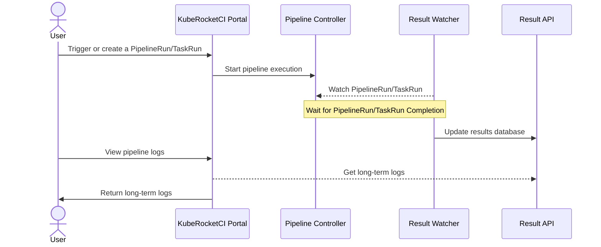

<!-- markdownlint-disable MD025 -->

import Tabs from '@theme/Tabs';
import TabItem from '@theme/TabItem';

# Tekton Long-Term Log Storage

<head>
  <link rel="canonical" href="https://docs.kuberocketci.io/docs/operator-guide/ci/tekton-long-term-storage" />
</head>

Tekton Results aims to help users logically group CI/CD workload history and separate out long term result storage away from the Pipeline controller. This allows you to:

- Provide custom Results metadata about your CI/CD workflows not available in the Tekton TaskRun/PipelineRun CRDs (for example: post-run actions).
- Group related workloads together (e.g. bundle related TaskRuns and PipelineRuns into a single unit).
- Make long-term result history independent of the Pipeline CRD controller, letting you free up etcd resources for Run execution.
- Store logs produced by the TaskRuns/PipelineRuns so that completed Runs can be cleaned to save resources.

## Long-Term Log Access Workflow

The following diagram illustrates the workflow for accessing long-term logs for pipelines in the KubeRocketCI Portal:




## Install Tekton Results

Tekton Results is deployed as part of the Tekton Pipelines installation. For installing Tekton Pipelines, we recommend using the [add-ons approach](https://github.com/epam/edp-cluster-add-ons/blob/4456631feb6510ff875b5b839534968c3846da7a/clusters/core/apps/values.yaml#L286C1-L289C30). Here's an example of how to configure values.yaml before installation:

    ```yaml
    tekton:
        createNamespace: true
        enable: true
        namespace: tekton-pipelines
    ```

## Configuration

:::note
We use Postgres operator to connect to Tekton results, but you can use any other external databases supported. Please align configuration accordingly to Tekton result [documentation](https://github.com/tektoncd/results/blob/v0.18.0/docs/external-database.md).
:::

To configure long-term log storage for pipelines in the KubeRocketCI Portal, follow the steps below:

1. Storage sizes in the [results-pg.yaml](https://github.com/epam/edp-cluster-add-ons/blob/main/clusters/core/addons/tekton/results-pg.yaml) file define the allocated volumes for the Tekton Results PostgreSQL cluster:

   - **Database instance storage**
     - Path: `spec.instances.dataVolumeClaimSpec.resources.requests.storage`
     - Default: `2Gi`
     - Description: Specifies the size of the main PostgreSQL data volume.

   - **Backup repository storage**
     - Path: `spec.backups.pgbackrest.repos.volume.volumeClaimSpec.resources.requests.storage`
     - Default: `2Gi`
     - Description: Specifies the size of the pgBackRest backup repository volume.

2. Storage and retention settings in the [results.yaml](https://github.com/epam/edp-cluster-add-ons/blob/main/clusters/core/addons/tekton/results.yaml) file define how Tekton Results result records are retained in the database and how related storage is configured:

   - **Log storage size**
     - Path: `PersistentVolumeClaim.spec.resources.requests.storage`
     - Default: `5Gi`
     - Description: Specifies the allocated disk size for storing pipeline logs.

   - **Retention period**
     - Path: `ConfigMap.data.defaultRetention` in `tekton-results-config-results-retention-policy`
     - Default: `"30"` days
     - Description: Defines how long log files are retained before being automatically removed.

   - **Cleanup schedule**
     - Path: `ConfigMap.data.runAt` in `tekton-results-config-results-retention-policy`
     - Default: `"0 18 * * *0*"`
     - Description: Specifies the cron expression that determines when automated log cleanup runs (daily at 6:00 PM UTC).

:::warning
The retention policy agent removes only database records from PostgreSQL. It does not delete associated log files stored on persistent volumes, S3, or GCS backends. As a result, log data may remain on disk and consume storage even after the corresponding records are expired.
:::

3. To remove physical log files from PVCs (not just database records), use the settings in the [results-clean-old-logs-cronjob.yaml](https://github.com/epam/edp-cluster-add-ons/blob/main/clusters/core/addons/tekton/results-clean-old-logs-cronjob.yaml) file:

   - **Cleanup schedule**
     - Path: `spec.schedule`
     - Default: `"0 18 * * *"`
     - Description: Specifies the cron expression that determines when the CronJob runs (daily at 6:00 PM UTC).

   - **Physical log retention (days)**
     - Path: `spec.jobTemplate.spec.template.spec.containers.command` (the `-mtime +N` value in the `find` command)
     - Default: `30` days
     - Description: Physical log files in `/tekton-results/logs/` older than this many days are deleted from the PVC. The value is the number in `-mtime +N` (e.g. `+30` keeps files for 30 days).

:::note
In this example, the PGO (PostgreSQL Operator) is used for the Tekton Results database. 
:::

## Database Performance Indexes

Tekton Results creates its schema through GORM auto-migration, which adds no indexes beyond the primary keys. As the
history grows, the queries behind the KubeRocketCI Portal pipeline run history fall back to sequential scans and the
history views become progressively slower to load. Create the indexes below to keep those queries on index scans.

:::note
`CREATE INDEX CONCURRENTLY` builds the index without locking the table for writes, so these statements are safe to run
against a live database. They cannot run inside a transaction block, which is why each statement is applied separately.
:::

1. Find the primary PostgreSQL pod:

    ```bash
    PG_POD=$(kubectl get pods -n tekton-pipelines \
      -l postgres-operator.crunchydata.com/cluster=results,postgres-operator.crunchydata.com/role=master \
      -o jsonpath='{.items[0].metadata.name}')
    ```

2. Create the index covering list queries that filter by parent and type and sort by time:

    ```bash
    kubectl exec -it -n tekton-pipelines "$PG_POD" -c database -- \
      psql -U postgres -d results -c \
      "CREATE INDEX CONCURRENTLY IF NOT EXISTS idx_records_parent_type_created ON records (parent, type, created_time DESC);"
    ```

3. Create the index covering JSONB containment queries (`@>`) used for codebase and name filtering:

    ```bash
    kubectl exec -it -n tekton-pipelines "$PG_POD" -c database -- \
      psql -U postgres -d results -c \
      "CREATE INDEX CONCURRENTLY IF NOT EXISTS results_annotations ON results USING GIN (annotations jsonb_path_ops);"
    ```

4. Create the index covering summary annotation filtering, which the DORA metrics views rely on:

    ```bash
    kubectl exec -it -n tekton-pipelines "$PG_POD" -c database -- \
      psql -U postgres -d results -c \
      "CREATE INDEX CONCURRENTLY IF NOT EXISTS record_summary_annotations ON results USING GIN (recordsummary_annotations jsonb_path_ops);"
    ```

5. Verify that the indexes exist:

    ```bash
    kubectl exec -it -n tekton-pipelines "$PG_POD" -c database -- \
      psql -U postgres -d results -c "\di+"
    ```

6. Confirm that queries use them. The plan should report an `Index Scan` or `Bitmap Index Scan` on
   `idx_records_parent_type_created` rather than a `Seq Scan`:

    ```bash
    kubectl exec -it -n tekton-pipelines "$PG_POD" -c database -- \
      psql -U postgres -d results -c "
        EXPLAIN ANALYZE
        SELECT * FROM records
        WHERE parent LIKE 'tekton-pipelines/results/%'
          AND type = 'tekton.dev/v1.PipelineRun'
        ORDER BY created_time DESC
        LIMIT 10;
      "
    ```

To remove the indexes, drop them by name:

```bash
kubectl exec -it -n tekton-pipelines "$PG_POD" -c database -- \
  psql -U postgres -d results -c "
    DROP INDEX IF EXISTS idx_records_parent_type_created;
    DROP INDEX IF EXISTS results_annotations;
    DROP INDEX IF EXISTS record_summary_annotations;
  "
```

## Related Articles

* [Add Application](../../user-guide/add-application.md)
* [Install Tekton](../install-tekton.md)
* [Install KubeRocketCI](../install-kuberocketci.md)
