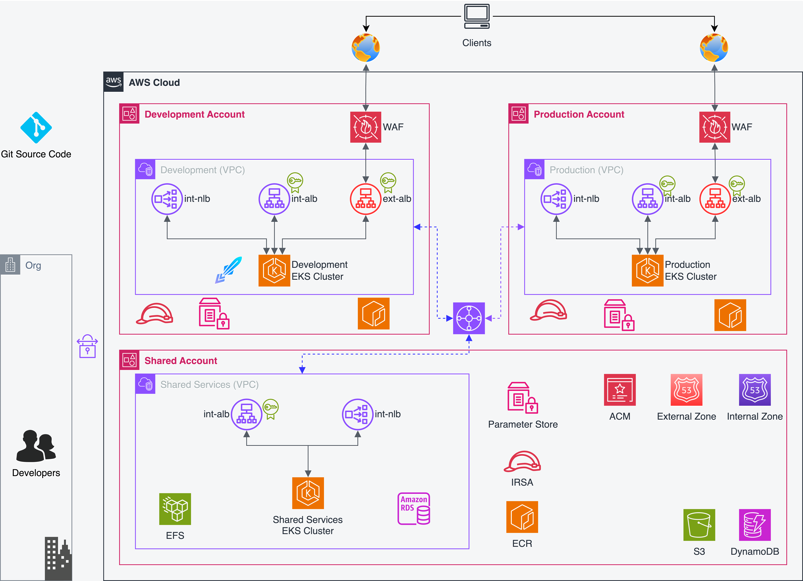

# KubeRocketCI Reference Architecture on AWS

The reference architecture of the KubeRocketCI on AWS is designed to provide a robust and scalable CI/CD system for developing and deploying software in a repeatable and automated manner. The architecture leverages AWS Managed Services to enable developers to quickly deploy and manage infrastructure and applications. KubeRocketCI recommends to follow the best practices and patterns from the Well-Architected Framework, the AWS Architecture Center, and EKS Best Practices Guide.

## Architecture Details

The AWS Cloud comprises three accounts: Production, Shared, and Development.

:::note
  AWS Account management is out of scope for this document.
:::

Each account serves specific purposes:

* The **Production** account is used to host production workloads. The Production account serves as the final destination for deploying business applications. It maintains a separate ECR registry to store Docker images for production-level applications. The environment is designed to be highly resilient and scalable, leveraging the KubeRocketCI's CI/CD pipeline to ensure consistent and automated deployments. With proper access control and separation from development environments, the Production account provides a stable and secure environment for running mission-critical applications.
* The **Development** account is dedicated to development workload and lower environments. This account hosts the KubeRocketCI itself, running on AWS EKS. It provides developers an isolated environment to build, test, and deploy their applications in lower environments, ensuring separation from production workloads. Developers can connect to the AWS Cloud using a VPN, enforcing secure access.
* The **Shared** holds shared services that are accessible to all accounts within the organization. These services include SonarQube, Nexus, and Keycloak, which are deployed in Kubernetes Clusters managed by AWS Elastic Kubernetes Service (EKS). The shared services leverage AWS RDS, AWS EFS, and AWS ALB/NLB. The deployment of the shared services is automated using Kubernetes cluster-addons approach with GitOps and Argo CD.

## Infrastructure as Code

Infrastructure as Code (IaC) is a key principle in the KubeRocketCI architecture. Terraform is the IaC tool to provision and manage all services in each account. AWS S3 and AWS DynamoDB serve as the backend for Terraform state, ensuring consistency and reliability in the deployment process. This approach enables the architecture to be version-controlled and allows for easy replication and reproducibility of environments.

## Container Registry

The architecture utilizes AWS Elastic Container Registry (ECR) as a Docker Registry for container image management. ECR offers a secure, scalable, and reliable solution for storing and managing container images. It integrates seamlessly with other AWS services and provides a highly available and durable storage solution for containers in the CI/CD pipeline.

## IAM Roles for Service Accounts (IRSA)

The KubeRocketCI implements IAM Roles for Service Accounts (IRSA) to provide secure access to AWS services from Kubernetes Clusters. This feature enables fine-grained access control with individual Kubernetes pods assuming specific IAM roles for authenticated access to AWS resources. IRSA eliminates the need for managing and distributing access keys within the cluster, significantly enhancing security and reducing operational complexity.

## SSL Certificates

The architecture uses the AWS Certificate Manager (ACM) to secure communication between services to provide SSL certificates. ACM eliminates the need to manually manage SSL/TLS certificates, automating the renewal and deployment process. The KubeRocketCI ensures secure and encrypted traffic within its environment by leveraging ACM.

## AWS WAF

The architecture's external Application Load Balancer (ALB) endpoint is protected by the AWS Web Application Firewall (WAF). WAF protects against common web exploits and ensures the security and availability of the applications hosted within the KubeRocketCI. It offers regular rule updates and easy integration with other AWS services.

## Parameter Store and Secrets Manager

The architecture leverages the AWS Systems Manager Parameter Store and Secrets Manager to securely store and manage all secrets and parameters utilized within the EKS clusters—parameter Store stores general configuration information, such as database connection strings and API keys. In contrast, Secrets Manager securely stores sensitive information, such as passwords and access tokens. By centralizing secrets management, the architecture ensures proper access control and reduces the risk of unauthorized access.

## Observability and Monitoring

For observability and monitoring, the KubeRocketCI leverages a suite of AWS Managed Services designed to provide comprehensive insights into the performance and health of applications and infrastructure:

**AWS CloudWatch** is utilized for monitoring and observability, offering detailed insights into application and infrastructure performance. It enables real-time monitoring of logs, metrics, and events, facilitating proactive issue resolution and performance optimization.

**AWS OpenSearch Service** (successor to Amazon Elasticsearch Service) provides powerful search and analytics capabilities. It allows for the analysis of log data and metrics, supporting enhanced application monitoring and user experience optimization.

**AWS Managed Grafana** offers a scalable, secure, and fully managed Grafana service, enabling developers to create and share dashboards for visualizing real-time data.

**AWS Prometheus Service**, a managed Prometheus-compatible monitoring service, is used for monitoring Kubernetes and container environments. It supports powerful queries and provides detailed insights into container and microservices architectures.

## Summary

The reference architecture of the KubeRocketCI on AWS provides a comprehensive and scalable environment for building and deploying software applications. With a strong focus on automation, security, and best practices, this architecture enables developers to leverage the full potential of AWS services while following industry-standard DevOps practices.
