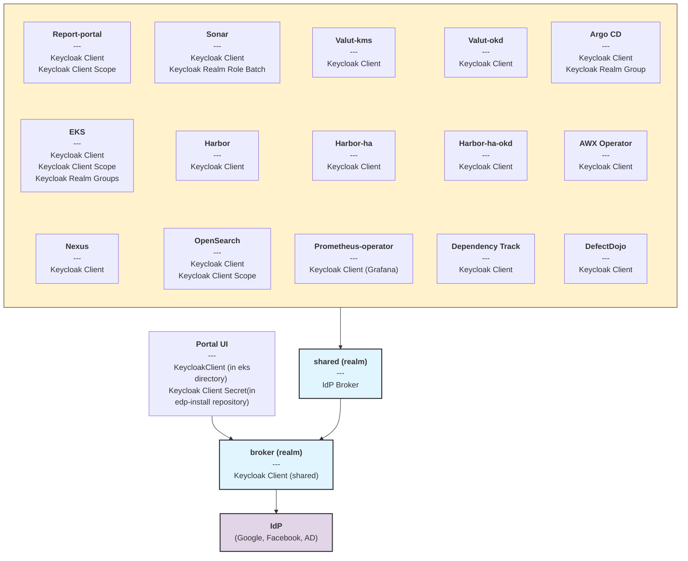
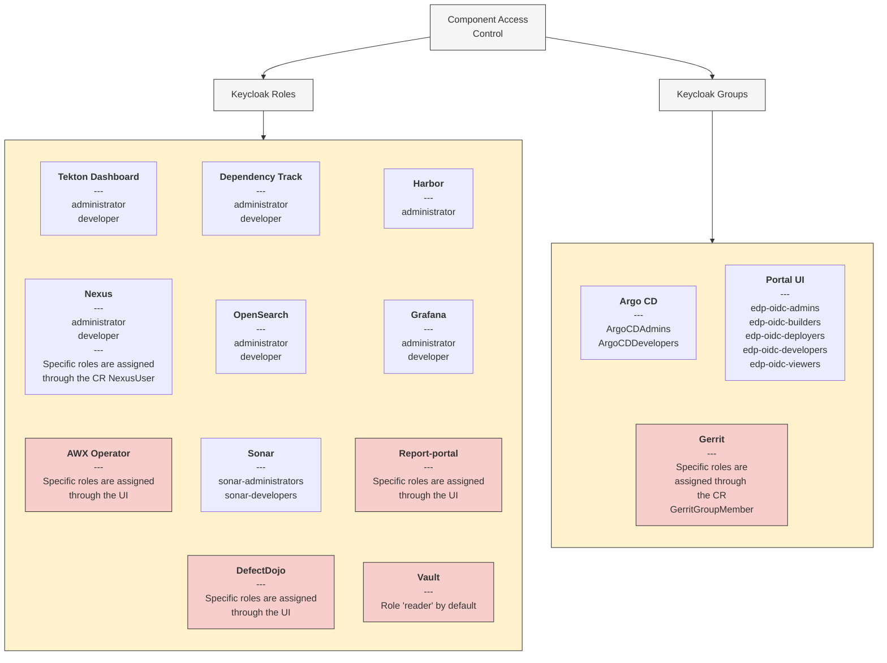

# Overview

In KubeRocketCI, access control is implemented through various authorization methods. User and group permissions are regulated using Keycloak, which integrates with RBAC. Permissions for third-party tools are managed using [custom resources](https://kubernetes.io/docs/concepts/extend-kubernetes/api-extension/custom-resources/). This document provides an overview of the access management entities in KubeRocketCI, including Kubernetes groups, custom resources, and Keycloak realm roles. It also details their respective permissions and the tools they are applied to.

## Keycloak

This section explains what realm roles and realm groups are and how they function within Keycloak.

The diagram illustrates the authentication flow within a system based on the [Add-Ons](../add-ons-overview.md) approach, where all tools and their Keycloak resources are managed within the [edp-cluster-add-ons](https://github.com/epam/edp-cluster-add-ons) repository.
Various tools such as Argo CD, Nexus, Sonar, Report-portal, Harbor, and others are configured as OIDC (OpenID Connect) clients within a `shared` realm.
Each component can have its own unique configurations, including Keycloak realm roles, realm groups, or client scopes. The `shared` realm, in turn, acts as an OIDC client to the `broker` realm, which serves as a proxy to external Identity Providers (IdPs) like Google, Facebook, and Active Directory (AD), supporting both OIDC and SAML protocols.



### Realm Roles

The Keycloak realm of `shared` has two realm roles with a composite types named `administrator` and `developer`:

* The `administrator` realm role is designed for users who need administrative access to the tools used in the project.
This realm role contains the `sonar-administrators` role.
Users who are assigned the `administrator` realm role will be granted these two roles automatically.

* The `developer` realm role, on the other hand, is designed for users who need access to the development tools used in the project.
This realm role also contains the `sonar-developers` role.
Users who are assigned the `developer` realm role will be granted these two roles automatically.

These realm roles have been defined to make it easier to assign groups of rights to users.

The table below shows the realm roles and the composite types they relate to.

| Realm Role Name | Regular Role | Composite role |
| - | :-: | :-: |
| administrator | | :white_check_mark: |
| developer | | :white_check_mark: |
| sonar-administrators | :white_check_mark: | |
| sonar-developers | :white_check_mark: | |

### Realm Groups

KubeRocketCI uses two different realms for group management, `shared` and `broker`:

* The `shared` realm contains two groups that are specifically used for controlling access to Argo CD. These groups are named `ArgoCDAdmins` and `ArgoCD-edp-users`.

* The `broker` realm contains five groups that are used for access control in both the KubeRocketCI portal and EKS cluster. These groups are named `edp-oidc-admins`, `edp-oidc-builders`, `edp-oidc-deployers`,`edp-oidc-developers` and `edp-oidc-viewers`.

| Realm Group Name | Realm Name |
| - | - |
| `ArgoCDAdmins` | shared |
| `ArgoCD-edp-users` | shared |
| `edp-oidc-admins` | broker |
| `edp-oidc-builders` | broker |
| `edp-oidc-deployers` | broker |
| `edp-oidc-developers` | broker |
| `edp-oidc-viewers` | broker |

## SonarQube

In the case of SonarQube, there are two ways to manage access: via Keycloak and via KubeRocketCI approach. This sections describes both of the approaches.

### Manage Access via Keycloak

SonarQube access is managed using Keycloak roles in the `shared` realm.
The `sonar-developers` and `sonar-administrators` realm roles are the two available roles that determine user access levels.
To grant access, the corresponding role must be added to the user in Keycloak.

For example, a user who needs developer access to SonarQube should be assigned the `sonar-developers` or `developer` composite role in Keycloak.

### KubeRocketCI Approach for Managing Access

KubeRocketCI provides its own SonarQube Permission Template, which is used to manage user access and permissions for SonarQube projects.

The template is stored in the custom SonarQube resource of the operator, an example of a custom resource can be found below.

:::note Sonar Permission Template

  ```yaml
  apiVersion: v2.edp.epam.com/v1
  kind: SonarPermissionTemplate
  metadata:
    name: edp-default
  spec:
    description: KubeRocketCI permission templates (DO NOT REMOVE)
    groupPermissions:
      - groupName: non-interactive-users
        permissions:
          - user
      - groupName: sonar-administrators
        permissions:
          - admin
          - user
      - groupName: sonar-developers
        permissions:
          - codeviewer
          - issueadmin
          - securityhotspotadmin
          - user
    name: edp-default
    projectKeyPattern: .+
    sonarOwner: sonar
  ```

:::

The SonarQube Permission Template contains three groups: `non-interactive-users`, `sonar-administrators` and `sonar-developers`:

* `non-interactive-users` are users who do not require direct access to the SonarQube project but need to be informed about the project's status and progress. This group has read-only access to the project, which means that they can view the project's data and metrics but cannot modify or interact with it in any way.

* `sonar-administrators` are users who have full control over the SonarQube project. They have the ability to create, modify, and delete projects, as well as manage user access and permissions. This group also has the ability to configure SonarQube settings and perform other administrative tasks.

* `sonar-developers` are users who are actively working on the SonarQube project. They have read and write access to the project, which means that they can modify the project's data and metrics. This group also has the ability to configure project-specific settings and perform other development tasks.

These groups are designed to provide different levels of access to the SonarQube project, depending on the user's role and responsibilities.

:::info
  If a user has no group, it will have the `sonar-users` group by default. This group does not have any permissions
  in the `edp-default` Permission Template.
:::

The permissions that are attached to each of the groups are described below in the table:

| Group Name | Permissions |
| - | - |
| `non-interactive-users` | user |
| `sonar-administrators` | admin, user |
| `sonar-developers` | codeviewer, issueadmin, securityhotspotadmin, user |
| `sonar-users` | - |

## Nexus Repository Manager

Users authenticate to Nexus using their Keycloak credentials.

During the authentication process, the OAuth2-Proxy receives the user's role from Keycloak.

:::info
  Only users with either the `administrator` or `developer` role in Keycloak can access Nexus.
:::

Nexus has four distinct roles available, including `edp-admin`, `edp-viewer`, `nx-admin` and `nx-anonymous`.
To grant the user access to one or more of these roles, an entry must be added to the custom Nexus resource.

For instance, in the context of the custom Nexus resource, the user `user_1@example.com` has been assigned the `nx-admin` role.
An example can be found below:

:::note Nexus

  ```yaml
  apiVersion: v2.edp.epam.com/v1
  kind: Nexus
  metadata:
    name: nexus
  spec:
    basePath: /
    edpSpec:
      dnsWildcard: example.com
    keycloakSpec:
      enabled: false
      roles:
        - developer
        - administrator
    users:
      - roles:
          - nx-admin
        username: user_1@example.com
  ```

:::

## Gerrit

The user should use their credentials from Keycloak when authenticating to Gerrit.

After logging into Gerrit, the user is not automatically attached to any groups.
To add a user to a group, the `GerritGroupMember` custom resource must be created. This custom resource specifies
the user's email address and the name of the group to which they should be added.

The Custom Resource below is an example of the `GerritGroupMember` resource:

:::note Gerrit Group Member

  ```yaml
  apiVersion: v2.edp.epam.com/v1
  kind: GerritGroupMember
  metadata:
    name: user-admins
  spec:
    accountId: user@user.com
    groupId: Administrators
  ```

:::

After the `GerritGroupMember` resource is created, the user will have the permissions and access levels associated with that group.

## KubeRocketCI Portal and EKS Cluster

Both Portal and EKS Cluster use Keycloak groups for controlling access.
Users need to be added to the required group in Keycloak to get access.
The groups that are used for access control are in the `broker` realm.

:::warning
  For the Kubernetes cluster to correctly manage access control, Keycloak must be configured as an OpenID Connect (OIDC) provider. Ensure that your Keycloak setup is properly configured for OIDC before proceeding.
:::

:::note
  The `broker` realm keeps Kubernetes OIDC client.
:::

### Keycloak Groups

There are two types of groups provided for users:

* Independent group: provides the minimum required permission set.
* Extension group: extends the rights of an independent group.

For example, the `edp-oidc-viewers` group can be extended with rights from the `edp-oidc-builders` group.

| Group Name | Independent Group | Extension Group |
| - | :-: | :-: |
|`edp-oidc-admins`    | :white_check_mark: | |
|`edp-oidc-developers`| :white_check_mark: | |
|`edp-oidc-viewers`   | :white_check_mark: | |
|`edp-oidc-builders`  | | :white_check_mark: |
|`edp-oidc-deployers` | | :white_check_mark: |

| Name | Action List |
| - | - |
| View | Getting of all namespaced resources |
| Build | Starting a PipelineRun from KubeRocketCI portal |
| Deploy | Deploying a new version of application via Argo CD Application |

| Group Name | View | Build | Deploy | Full Namespace Access |
| - | :-: | :-: | :-: | :-: |
|`edp-oidc-admins`    | :white_check_mark: | :white_check_mark: | :white_check_mark: | :white_check_mark: |
|`edp-oidc-developers`| | :white_check_mark: | :white_check_mark: | |
|`edp-oidc-viewers`   | :white_check_mark: | | | |
|`edp-oidc-builders`  | | :white_check_mark: | | |
|`edp-oidc-deployers` | | | :white_check_mark: | |

:::note
  Originally, the `edp-oidc-developer` group members come solely with the permissions to initiate pipelines. Assigning them to the `edp-oidc-viewers` group grants necessary permissions to view pipelines in the KubeRocketCI portal.
:::

### Cluster RBAC Resources

The `shared` namespace has five role bindings that provide the necessary permissions for the Keycloak groups
described above.

| Role Binding Name| Role Name | Groups |
| - | - | - |
| tenant-admin | cluster-admin | `edp-oidc-admins` |
| tenant-builder | tenant-builder | `edp-oidc-builders` |
| tenant-deployer | tenant-deployer | `edp-oidc-deployers` |
| tenant-developer | tenant-developer | `edp-oidc-developers` |
| tenant-viewer | view | `edp-oidc-viewers` , `edp-oidc-developers` |

:::note
  KubeRocketCI provides an aggregate ClusterRole with permissions to view custom KubeRocketCI resources. ClusterRole is named `edp-aggregate-view-edp`
:::

:::info
  The `tenant-admin` RoleBinding will be created in a created namespace by `cd-pipeline-operator`.<br />
  `tenant-admin` RoleBinding assign the `admin` role to `edp-oidc-admins` and `edp-oidc-developers` groups.
:::

### Grant User Access to the Created Namespaces

To provide users with admin or developer privileges for project namespaces, they need to be added to the `edp-oidc-admins` and `edp-oidc-developers` groups in Keycloak.

## Argo CD

In Argo CD, groups are specified when creating an AppProject to restrict access to deployed applications.
To gain access to deployed applications within a project, the user must be added to their corresponding Argo CD group
in Keycloak. This ensures that only authorized users can access and modify applications within the project.

:::info
  By default, only the `ArgoCDAdmins` group is automatically created in Keycloak.
:::

## Component Access Control Overview

The diagram presented below provides an overview of the access control mechanisms for various applications integrated with Keycloak.
It illustrates two primary methods of managing user access: [Keycloak roles](#realm-roles) and [Keycloak groups](#realm-groups). Certain components, highlighted in red, require additional configuration directly within the application's UI.



For detailed instructions on setting up OIDC integration for various components, please refer to the following articles:

1. **AWX** - [Community Documentation](https://ansible.readthedocs.io/projects/awx/en/latest/)
2. **DefectDojo** - [DefectDojo Permissions](https://documentation.defectdojo.com/usage/permissions/)
3. **Nexus** - [Nexus authentication process](#nexus-repository-manager)
4. **Report Portal** - [Report Portal Keycloak Integration](../project-management-and-reporting/reportportal-keycloak.md)
5. **Vault** - [OIDC provider configuration](https://developer.hashicorp.com/vault/docs/auth/jwt/oidc-providers/keycloak)
6. **Tekton** - [Tekton Dashboard Authentication](oauth2-proxy.md)
7. **Gerrit** - [Gerrit Authentication](#gerrit)

## Related Articles

* [KubeRocketCI Portal Overview](../../user-guide/index.md)
* [EKS OIDC With Keycloak](configure-keycloak-oidc-eks.md)
* [Argo CD Integration](../cd/argocd-integration.md)
