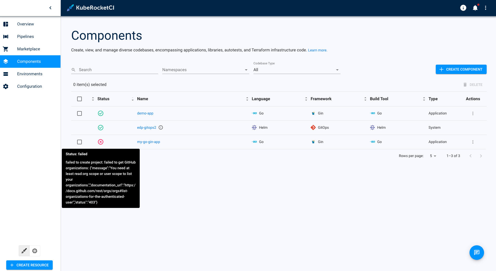
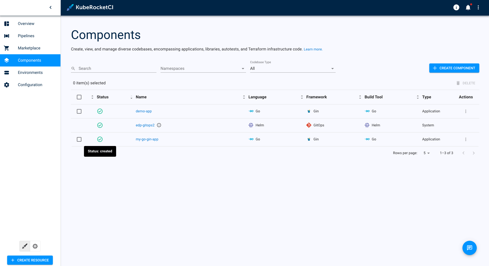

# Codebase Creation Issues

This troubleshooting page covers issues related to codebases.

## Problem

Application can't be added in the KubeRocketCI portal:

  

## Cause

Multiple factors can contribute to this issue occurring:

| Short error | Description |
|-------------|-------------|
| Need at least read:org scope | This error occurs when the token used for Git Server integration lacks specific rights. To resolve this issue, adjust the token rights or create a new token with the required set of permissions. Refer to [Manage Git Providers](../../user-guide/add-git-server/) for details. Ensure to set correct Git Server properties as described in [Manage Git Servers](../../user-guide/add-git-server/). |
| Name already exist | This error indicates that the application name you are trying to add in the KubeRocketCI portal already exists. Check if the application or codebase with the same name has been created previously. If necessary, choose a different name for your application or codebase to avoid naming conflicts. |
| Failed to push changes | This error might occur due to insufficient permissions or issues with the repository access. Ensure the token or SSH key used has the proper rights to push changes to the repository. Additionally, verify that the repository URL and branch specified in the codebase configuration are correct and accessible. |
| Invalid project ID | The "Invalid project ID" error message appears when creating a codebase with an incorrectly set repository relative path. To resolve this issue, ensure that the Git repository relative path is formatted correctly, prefixing the repository name with the respective account or organization name. |

## Solution

For instance, to address the `Need at least read:org` scope issue:

1. Adjust token rights or create a new token with the required set of permissions. Please refer to the [Manage Git Providers](../../user-guide/add-git-server.md) for details.

2. Ensure to set correct Git Server properties. The process of adding a Git Server is described in the [Manage Git Servers](../../user-guide/add-git-server.md) page.

3. Retry to create application.

  

## Related Articles

* [Manage GitServer](../../user-guide/add-git-server.md)
