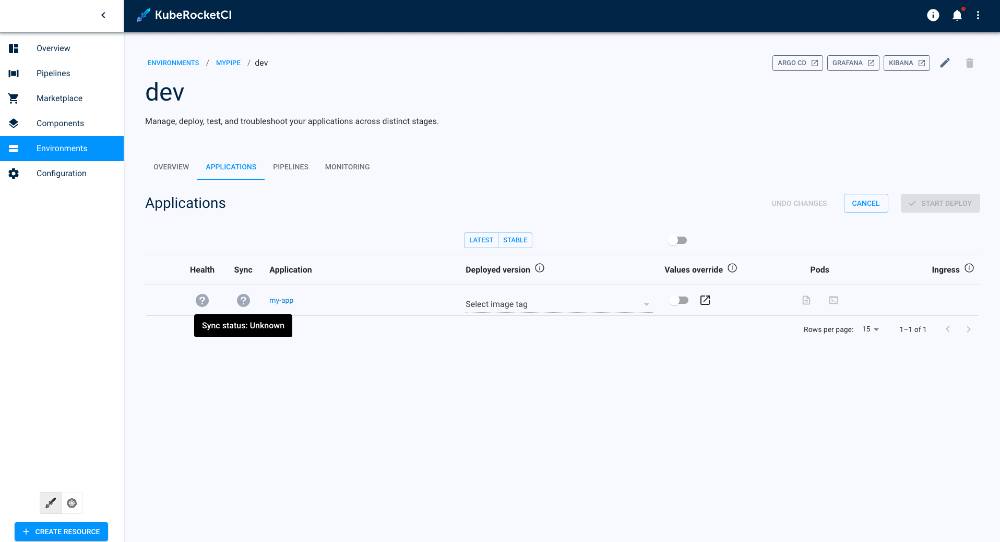

# Sync and Health Status Unknown

## Problem

In the **Stage Detail** page, the application **Health status** and **Sync Status** is unknown. The `deploy` button doesn't work when attempting to create a stage.

  

## Cause

Incorrect Configuration of ArgoCD Integration

## Solution

1. Please verify that the [Argo CD Integration](../../operator-guide/cd/argocd-integration.md) process has been completed and all steps have been executed correctly.

2. Check the status of the application:

    

## Related Articles

* [Argo CD Integration](../../operator-guide/cd/argocd-integration.md)
