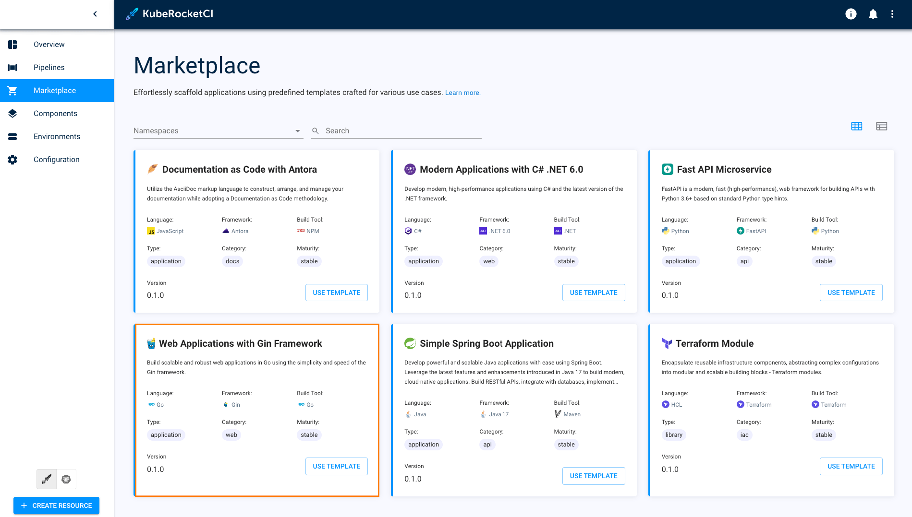
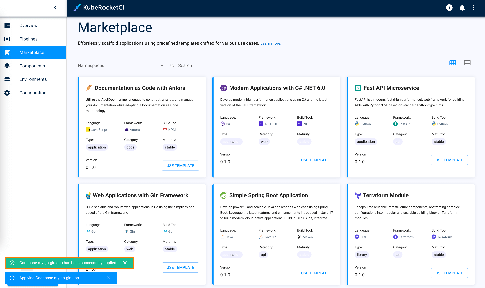
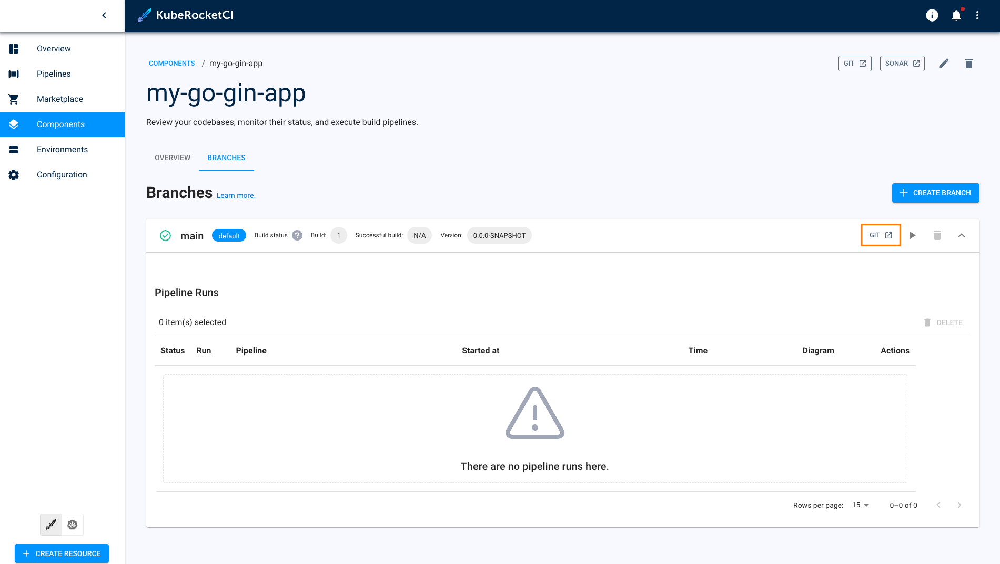
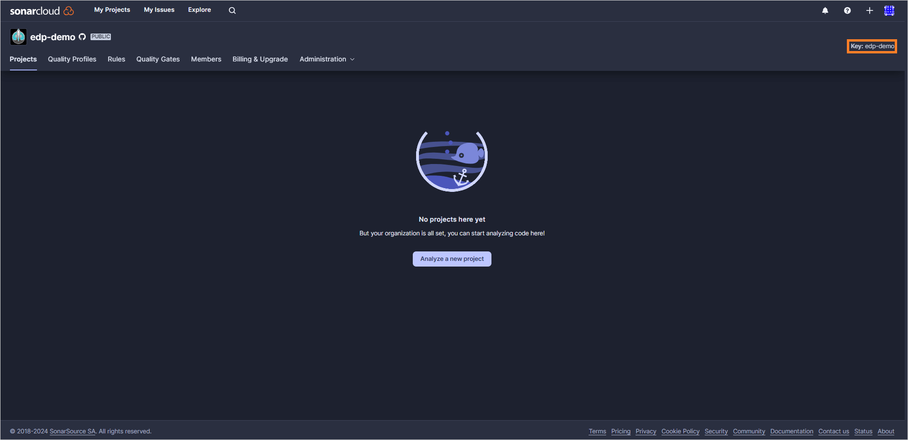
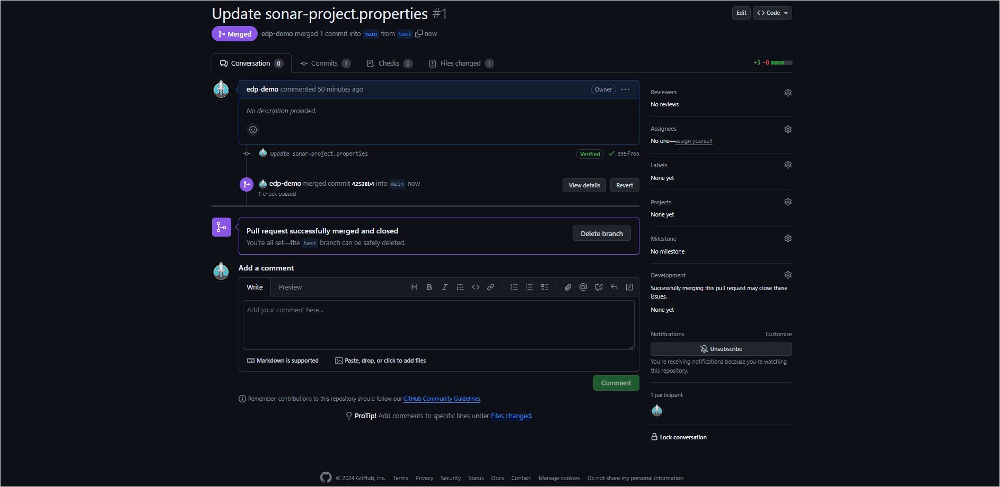
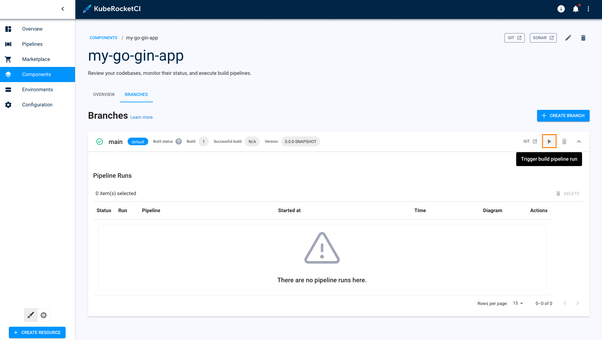
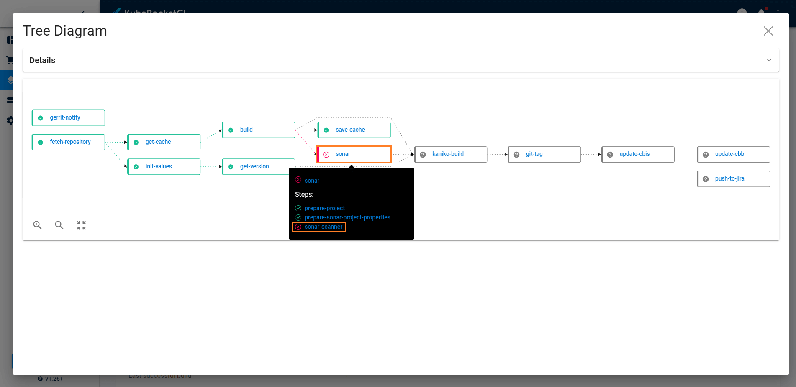
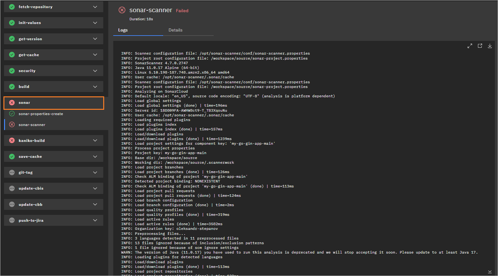
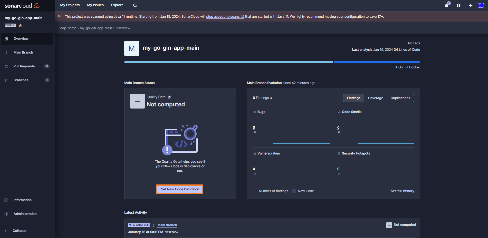
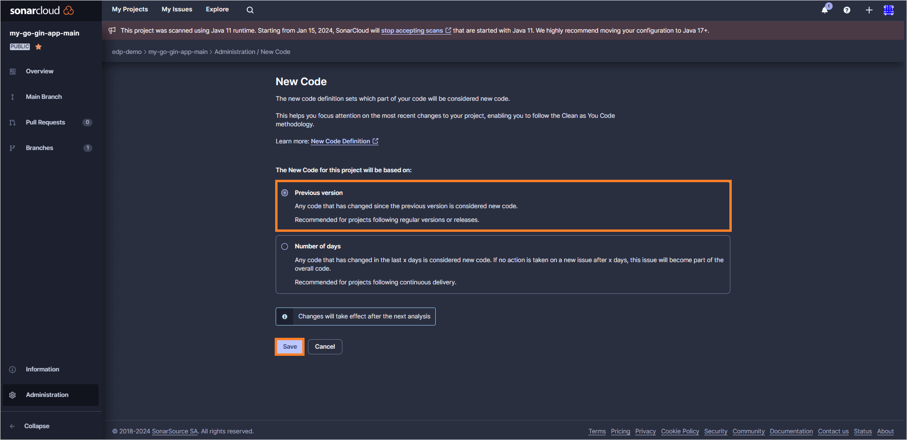

# Create Application

In KubeRocketCI, all software components, such as applications, libraries, Terraform infrastructures, and automated tests, are referred to as codebases. KubeRocketCI provides flexible methods for scaffolding these components.

This guide will walk you through the process of creating a Go application using the Gin framework. The [Marketplace](../user-guide/marketplace.md) will be used to streamline the application creation process.

## Application Onboarding

To create the first application, complete the instructions below:

1. In the UI Portal, navigate to **Marketplace**.

2. In the `Marketplace` section, select **Web Applications with Gin Framework**:

    

3. In the appeared window, define the following values and click **Apply**:

    - Component name: `my-go-gin-app`
    - Description: `My first application`
    - Git server: `github`
    - Repository name: `<github_account_name>/my-go-gin-app`
    - Codebase versioning type: `edp`
    - Start version from: `0.1.0`
    - Suffix: `SNAPSHOT`

    

4. As soon as the codebase is created, navigate to it via the notification at the bottom left corner or click the **Components** section:

    

## Build Application

Having created the Go application, proceed to build it by performing the following actions:

1. In the component details page, expand the application and click the **Go to the Source Code** button:

    

2. In the opened Source Code, create new branch called **test**.

3. In the SonarCloud organization page, copy the value of the SonarCloud organization name:

    

4. In the **test** branch in GitHub, open the `sonar-project.properties` file and include the `sonar.language=go`, `sonar.scanner.force-deprecated-java-version=true`, and `sonar.organization` parameters where `sonar.organization` is equal to the value copied in the previous step, resulting in the following configuration:

    ```ini
    sonar.projectKey=my-go-gin-app
    sonar.projectName=my-go-gin-app
    sonar.go.coverage.reportPaths=coverage.out
    sonar.test.inclusions=**/*_test.go
    sonar.exclusions=**/cmd/**,**/deploy/**,**/deploy-templates/**,**/*.groovy,**/config/**
    sonar.language=go
    sonar.organization=<organization-key>
    sonar.scanner.force-deprecated-java-version=true
    ```

    

5. Commit the changes.

6. Create and merge a pull request:

    

7. Run the `kubectl edit task` command to update the version of the image that is used in the **sonarqube-scanner** task from `4.7` to `5.0.1`:

    :::info
      This step is necessary because SonarCloud no longer supports Java 11, which is used in the sonarqube-scanner image. This solution is specifically designed for KubeRocketCI versions 3.7.x and lower. Users of KubeRocketCI 3.8+ can skip this step.

      To update the sonarqube-scanner task, run the following command:

      ```bash
      kubectl edit task sonarqube-scanner -n edp
      ```

      Then, modify the task YAML as follows:

      ```yaml
      - image: sonarsource/sonar-scanner-cli:5.0.1
        name: sonar-scanner
        workingDir: $(workspaces.source.path)
        env:
          - name: SONAR_TOKEN
            valueFrom:
              secretKeyRef:
                name: $(params.ci-sonarqube)
                key: token
        command:
          - sonar-scanner
      ```

    :::

8. In the component details page, click the **Trigger build pipeline run** button:

    

9. Enable port-forwarding for the edp-tekton-dashboard service (in case ingress is not deployed):

    ```bash
    kubectl port-forward service/edp-tekton-dashboard 64372:8080 -n edp
    ```

10. To observe the build pipeline status, click the tree diagram icon in the Diagram column:

    

11. Once the build is failed, click the failed stage name to open the Tekton pipeline run:

    

    The initial pipeline is expected to fail, primarily due to SonarCloud intricacies. It is important to set a Quality Gate in SonarCloud after the initial pipeline run and then re-trigger the build pipeline. After the pipeline failure, a new project should appear in the organization.

12. In the SonarCloud organization, select the newly appeared project and click the **Set New Code Definition** button:

    

13. In the **New Code** page, set the **Previous version** option and click **Save**:

    

14. In UI Portal, trigger build pipeline run one more time and wait until the pipeline run is finished.

Build pipelines in KubeRocketCI are specifically designed to generate an executable image of an application. Once the build process is complete, the resulting image can be deployed and run in a target environment.

Now that you have successfully built an application, the next step is to create an environment for deployment. In order to deploy the application, you will need to install and integrate Argo CD. To learn how to install and integrate Argo CD, please refer to the [Integrate Argo CD](./integrate-argocd.md) page.
