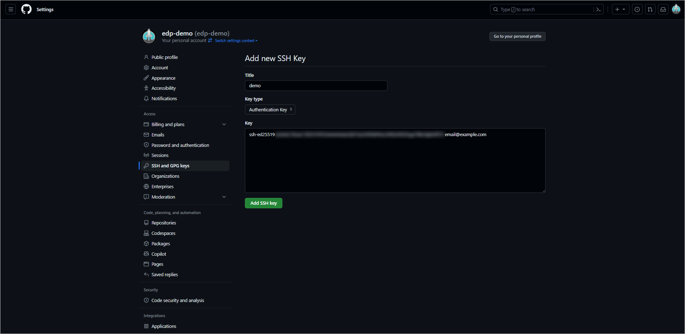
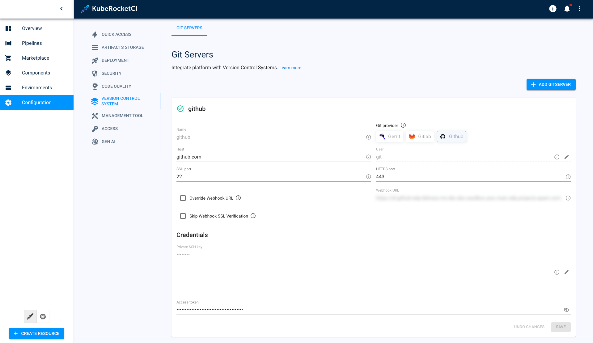

# Integrate GitHub

To initiate work in the KubeRocketCI, integration with a Version Control System (VCS) is essential. This integration facilitates the use of create, clone, and import strategies for handling source code.
This tutorial focuses on the create strategy, wherein an application is directly created in the integrated VCS solution for subsequent work. Here, you will find instructions on how to integrate KubeRocketCI with GitHub.

:::note
  Prior to moving forward, ensure you possess an active GitHub account and have successfully deployed the platform.
:::

## Integration Procedure

To integrate KubeRocketCI with GitHub, follow the steps below:

1. Generate an SSH key pair:

    ```bash
    ssh-keygen -t ed25519 -C "email@example.com"
    ```

2. Add the created SSH key (the public part) to the GitHub account:

    1. In the GitHub main page, click your user icon. Navigate to **Settings** -> **SSH and GPG keys** and click **New SSH key**.
    2. Create the `quick_start` key. Insert your `ed25519.pub` key data and click **Add SSH key**:

    

3. Generate an `access token` for the GitHub account with read/write access to the API:

    1. Log in to GitHub.
    2. Click the profile account and navigate to **Settings** -> **Developer Settings**.
    3. Select _Personal access tokens (classic)_ and generate a new token with the following permissions:

        

        :::note
          The following (Admin:repo, Admin:org, and User) access is necessary for the platform to retrieve Pull Request commits, their status, and author information.
        :::

        
        
        

    4. Save a new personal access token.

4. In UI Portal, navigate to **Configuration** -> **Version Control System** -> **Git Servers**. Define the following values and click **Save**:

    - Git provider: select `GitHub`
    - Host: `github.com`
    - User: `git`
    - SSH port: `22`
    - HTTPS port: `443`
    - Private SSH key: `your generated SSH private key`
    - Access token: `your account token generated in GitHub`

    

Ensure the Git server has a green status. To store container images, integrate platform with a container registry by navigating to the [Integrate DockerHub](./integrate-container-registry.md) page.
