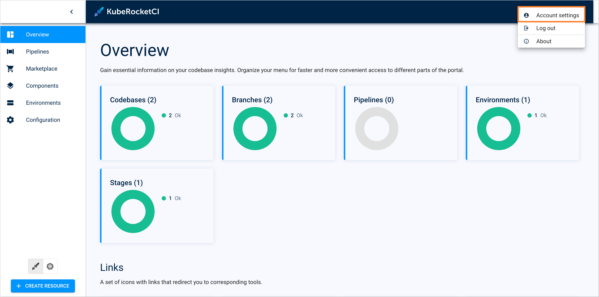
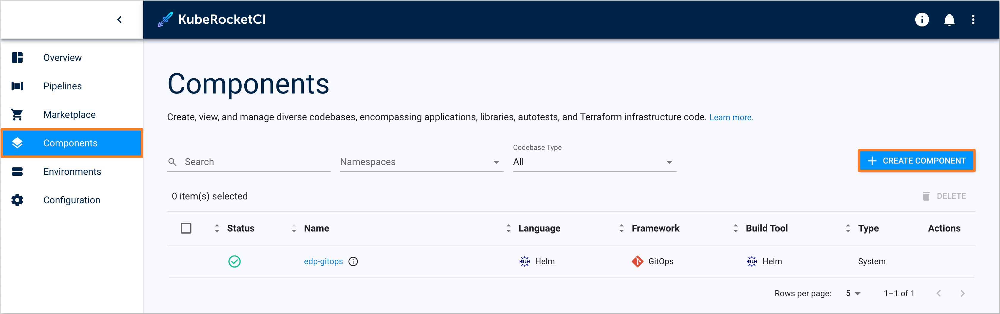
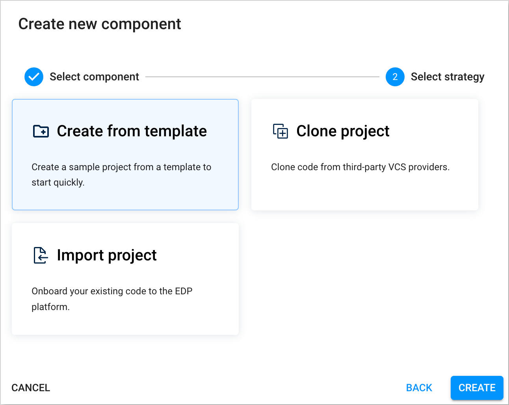

# Scaffold and Deploy FastAPI Application

## Overview

This use case outlines the process of creating and deploying a FastAPI application using a scaffolding tool. The purpose is to provide developers with a streamlined approach to generate a functional code structure for a FastAPI web application, including basic read functionality. The process also allows for customization to meet specific requirements and deployment to a development environment. By utilizing a standardized process for code review, testing, and deployment, developers can save time and effort while ensuring high code quality and reliability. The ultimate goal is to empower the development team to release new features and applications more efficiently, while maintaining a high level of code quality and reliability. The KubeRocketCI is used to facilitate this process.

<div style={{ display: 'flex', justifyContent: 'center' }}>
<iframe width="560" height="315" src="https://www.youtube.com/embed/TcPcIKYvKFo" title="YouTube video player" frameborder="0" allow="accelerometer; autoplay; clipboard-write; encrypted-media; gyroscope; picture-in-picture" allowfullscreen="allowfullscreen"></iframe>
</div>

### Roles

This documentation is tailored for the Developers and Team Leads.

### Goals

- Create a new FastAPI application quickly.
- Deploy the initial code to the DEV environment.
- Check CI pipelines.
- Delivery update using the GitOps approach.

### Preconditions

- KubeRocketCI instance is [configured](../operator-guide/prerequisites.md) with [GitOps](../user-guide/gitops.md) repo.
- Developer has access to the KubeRocketCI instances using the Single-Sign-On approach.
- Developer has merge permissions in the [GitOps](../user-guide/gitops.md) repository on GitHub.

## Scenario

To scaffold and deploy FastAPI Application, follow the steps below.

### Scaffold the New FastAPI Application

1. Open the Portal URL. Use the **Sign-In** option.

    

2. Ensure `Namespace` value in the User **Account settings** tab points to the namespace with the KubeRocketCI installation.

    

3. Create the new `Codebase` with the `Application` type using the `Create from template` strategy. Select the **Components** section and press the **Create component** button.

    

4. Choose the **Application** Codebase type as we intend to deliver our application as a container and deploy it within the Kubernetes cluster. Click the **Next** button.

    

5. Opt for the **Create from template** strategy to scaffold our application from the template provided by the KubeRocketCI and press the **Create** button:

    

6. On the **Add component info** tab, define the following values and press the **Next** button:

    - Git server: `github`
    - Repository name: `{github_account_name}/fastapi-demo`
    - Component name: `fastapi-demo`
    - Description: `fastapi-demo`
    - Application code language: `Python`
    - Language version/framework: `FastAPI`
    - Build tool: `Python`

    

7. On the **Specify advanced settings** tab, define the below values and push the **Create** button:

    - Default branch: `main`
    - Codebase versioning type: `edp`
    - Start version from: `0.0.1` and `SNAPSHOT`

    

8. Check the application status. It should be green:

    

### Deploy Application to the Development Environment

This section outlines the approach for deploying the application from the latest commit on the `main` branch. The following steps are involved:

1. Build the initial version of the application from the last commit on the `main` branch. This version is generated from the provided template.

2. Set up a `CD Pipeline` to enable continuous delivery to the development environment.

3. Deploy the initial version of the application to the development environment.

To succeed with the steps above, follow the instructions below:

1. Build Container from the latest branch commit. To build the initial version of the application's `main` branch, go to the **Components** -> **fastapi-demo** -> **Branches** -> **main** and press the **Trigger build pipeline run** button.

    

2. Build pipeline for the `fastapi-demo` application starts.

    

3. Track Pipeline's status by accessing **Pipelines** section by clicking the **fastapi-demo-main-build-zwpj** application link.

    

4. Ensure that Build Pipeline was successfully completed.

5. To enable application deployment create a CD Pipeline with a single environment - Development (with the name `dev`).

6. In the UI Portal, navigate to **Environments** tab and push the **Create environment** button to create pipeline.

    

7. In the **Create environment** dialog, define the below values:

    - **Pipeline tab**:

      - Pipeline name: `mypipe`

      

    - **Applications tab**. Add `fastapi-demo` application, select `main` branch, and leave `Promote in pipeline` unchecked:

      

    - **Stages tab**. Add the `dev` stage with the values below:
      - Cluster: `In cluster`
      - Stage name: `dev`
      - Description: `Development Environment`
      - Trigger type: `Manual`. We plan to deploy applications to this environment manually
      - Pipeline template: `deploy`
      - Quality gate type: `Manual`
      - Step name: `approve`
      - Push the `Apply` button

      

8. Deploy the initial version of the application to the development environment:

    - Open CD Pipeline with the name `mypipe`.
    - Select the `dev` stage from the **Stages** tab.
    - Push the **Configure deploy** button.
    - In the **Select image tag** field select version `0.0.1-SNAPSHOT.1` and push the **Start deploy** button.

    

### Check the Application Status

To ensure the application is deployed successfully, follow the steps below:

1. Ensure application status is `Healthy` and `Synced`, and the `Deployed version` points to `0.0.1-SNAPSHOT.1`:

    

2. Check that the selected version of the container is deployed on the `dev` environment. `${EDP_ENV}` - is the EDP namespace name:

    ```bash
    # Check the deployment status of fastapi-demo application
    $ kubectl get deployments -n ${EDP_ENV}-mypipe-dev
    NAME           READY   UP-TO-DATE   AVAILABLE   AGE
    fastapi-demo   1/1     1            1           14m
    ```

### Deliver New Code

This section describes the code delivery process. We need to deploy our `fastapi-demo` application that deploys `Ingress` object to expose API outside the Kubernetes cluster.

In the [GitOps](../user-guide/gitops.md) repository in GitHub, create the `values.yaml` file according to the `<pipeline-name>/<stage-name>/<application-name>-values.yaml` pattern.

Create a commit to the `main` branch in which add parameters to the newly created `values.yaml` file to enable the creation of an `Ingress` resource. Apply and push the changes to the repository.

   ```yaml
   ingress:
     enabled: true
   ```

1. Deliver `fastapi-demo` application to the Environment. Before the new version deployment, check the ingress object in `dev` namespace:

    ```bash
    $ kubectl get ingress -n ${EDP_ENV}-mypipe-dev
    No resources found in ${EDP_ENV}-mypipe-dev namespace.
    ```

   No ingress object exists as expected.

2. Deploy `fastapi-demo` application which has the ingress object in place. Since we use `Manual` deployment approach, we perform version upgrade by hand.

   Additionally, to ensure our application recognizes the changes in the GitOps repository related to enabling the creation of the `Ingress` resource, we need to set the **Override values** checkbox to `true` before deploying.

    - Go to the **Environments** section of the UI Portal, select `mypipe` and choose **dev** stage.
    - In the **Select image tag** section select the version `0.0.1-SNAPSHOT.1`
    - Set the **Override values** checkbox to `true` and push the **Start deploy** button.
    - Check that the application is deployed: application status is `Healthy` and `Synced`.

   

3. Check that the new version with Ingress is deployed:

    ```bash
    # Check Ingress object
    kubectl get ingress -n ${EDP_ENV}-mypipe-dev
    NAME           CLASS    HOSTS                                     ADDRESS          PORTS   AGE
    fastapi-demo   <none>   fastapi-demo-ko1zs-example.com         10.100.182.134        80    14m

    # Check application external URL
    curl https://your-hostname-appeared-in-hosts-column-above.example.com/
    {"Hello":"World"}
    ```

## Related Articles

- [Use Cases](./index.md)
