# Secured Secrets Management for Application Deployment

This use case demonstrates how to securely manage sensitive data, such as passwords, API keys, and other credentials, that are consumed by an application during development or runtime in production. The approach involves storing sensitive data in an external secret store located in a "vault" namespace (which can be Vault, AWS Secret Store, or any other provider). The process entails transmitting confidential information from the vault namespace to the deployed namespace to establish a connection to a database.

In this scenario, the KubeRocketCI platform is used to facilitate the management of sensitive data. By leveraging an external secret store, developers can ensure that confidential information is securely stored and accessed only when needed. This approach enhances the security of the deployment environment and mitigates the risk of exposing sensitive data.

To implement this approach, the following steps are involved:

1. Configure the KubeRocketCI platform with the desired external secret store provider, such as Vault or AWS Secret Store.

2. Create a separate namespace, referred to as the "vault" namespace, to store the sensitive data securely.

3. Store the sensitive data, such as passwords, API keys, and credentials, in the vault namespace using the chosen external secret store provider.

4. Establish a connection between the deployed namespace and the vault namespace to securely access the sensitive data when required.

By following these steps, developers can ensure that sensitive data is protected and accessed securely within the KubeRocketCI platform. This approach enhances the overall security of the application and reduces the risk of unauthorized access to confidential information.

## Roles

This documentation is tailored for the Developers and Team Leads.

## Goals

- Make confidential information usage secure in the deployment environment.

## Preconditions

- KubeRocketCI instance is [configured](../operator-guide/prerequisites.md) with [GitOps](../user-guide/gitops.md) repo (to be able to create components);
- External Secrets is [installed](../operator-guide/secrets-management/install-external-secrets-operator.md);
- Developer has access to the KubeRocketCI instances using the Single-Sign-On approach;
- Developer has merge permissions in the one of the [Git Server](../user-guide/git-server-overview.md) repository, e.g. GitHub;
- Developer has permissions to create resources such as namespace, roles, and role bindings.

## Scenario

To utilize External Secrets in the KubeRocketCI platform, follow the steps outlined below:

### Add Application

To begin, you will need an application first. Here are the steps to create it:

1. Open the UI Portal. Use the **Sign In** option:

    

2. In the top right corner, enter the **Account settings** and ensure that both `Default namespace` and `Allowed namespaces` are set:

    

3. Create the new component with the `Application` type using the `Create from template` strategy. Select the **Components** section and press the **Create component** button:

    

4. Choose the **Application** component type. Click the **Next** button:

    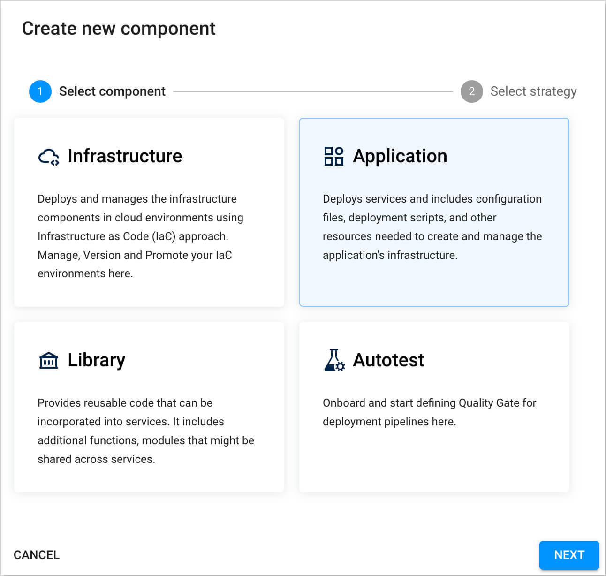

5. Opt for the **Create from template** strategy to scaffold our application from the template provided by the KubeRocketCI and press the **Create** button:

    

6. On the **Add component info** tab, define the following values and press the **Next** button:

    - Git server: `github`
    - Repository name: `{github_account_name}/es-usage`
    - Component name: `es-usage`
    - Description: `external-secrets usage`
    - Application code language: `Java`
    - Language version/framework: `Java 17`
    - Build tool: `Maven`

    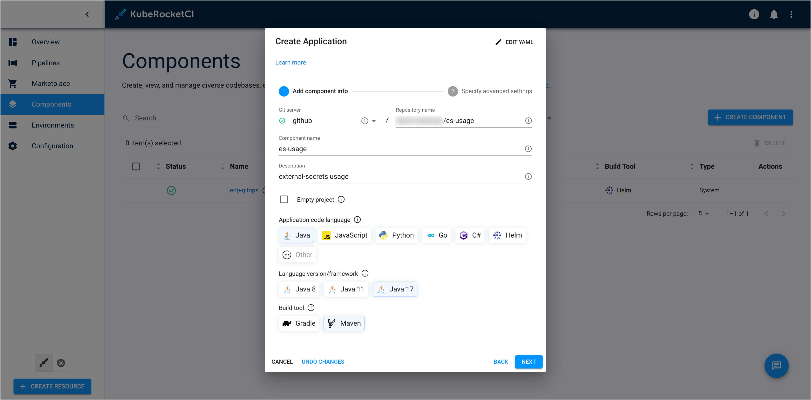

7. On the **Specify advanced settings** tab, define the below values and push the **Create** button:

    - Default branch: `main`
    - Codebase versioning type: `default`

    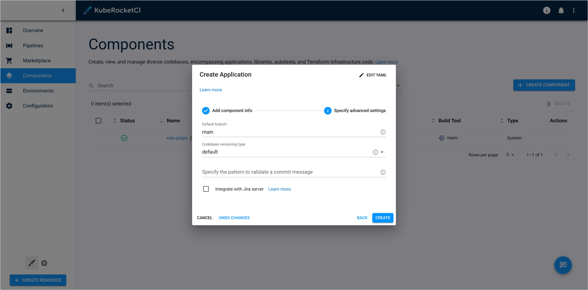

8. Check the application status. It should be green:

    

### Create CD Pipeline

This section outlines the process of establishing a CD pipeline within UI Portal. There are two fundamental steps in this procedure:

   - Create a `CD pipeline`;
   - Configure the CD pipeline `stage`.

Follow the instructions below to complete the process successfully:

1. In the UI Portal, navigate to **Environments** tab and push the **Create environment** button to create pipeline:

    

2. In the **Create environment** dialog, define the below values:

    - **Enter name**:

      - Pipeline name: `deploy`

      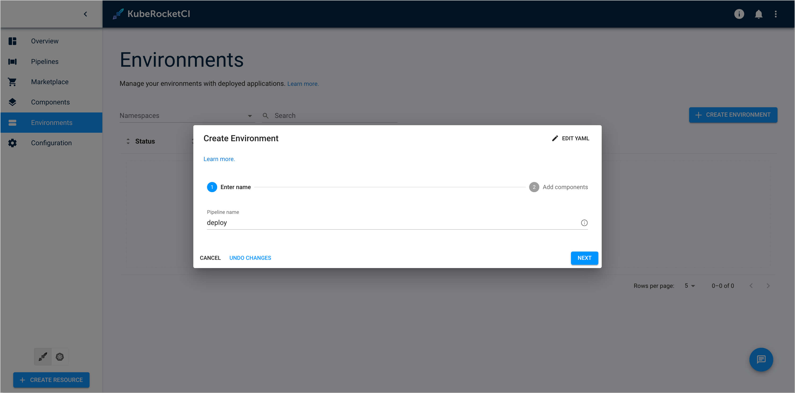

    - **Add components**. Add `es-usage` application, select `main` branch, and leave `Promote in pipeline` unchecked. Click the **Create** button:

      

3. Navigate to the created `deploy` CD pipeline and click the **Create Stage** button.

    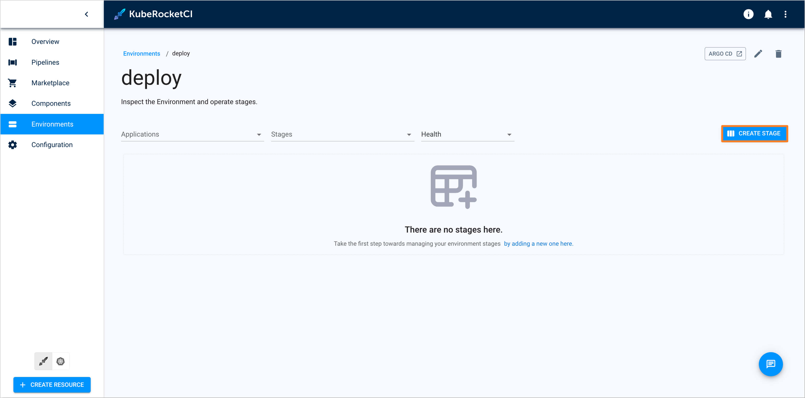

4. In the **Create stage** dialog add the `sit` stage with the values below:

     - **Configure stage**:

       - Cluster: `in cluster`
       - Stage name: `sit`
       - Description: `System integration testing`
       - Trigger type: `Manual`
       - Pipeline template: `deploy`

       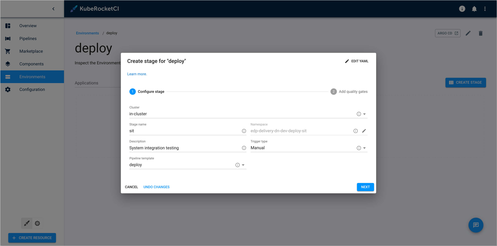

     - **Add quality gates**:

       - Quality gate type: `Manual`
       - Step name: `approve`

       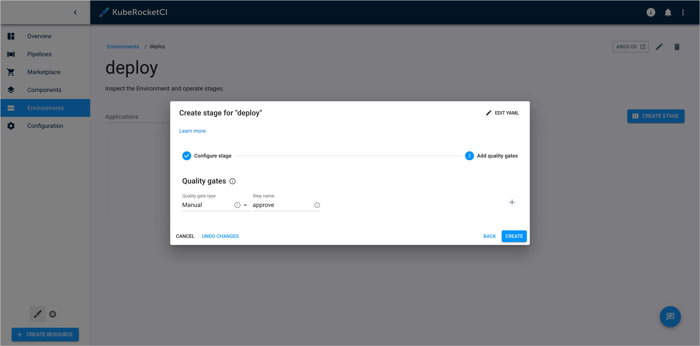

### Configure RBAC for External Secret Store

:::note
  In this scenario, three namespaces are used: `demo`, which is the namespace where KubeRocketCI is deployed, `demo-vault`, which is the vault where developers store secrets, and `demo-deploy-sit`, which is the namespace used for deploying the application. The target namespace name for deploying the application is formed with the pattern: `demo-<cd_pipeline_name>-<stage_name>`.
:::

To ensure the proper functioning of the system, it is crucial to create the following resources:

1. Create namespace `demo-vault` to store secrets:

    ```bash
    kubectl create namespace demo-vault
    ```

2. Create Secret:

    ```yaml
    apiVersion: v1
    kind: Secret
    metadata:
      name: mongo
      namespace: demo-vault
    stringData:
      password: pass
      username: user
    type: Opaque
    ```

3. Create Role to access the secret:

    ```yaml
    apiVersion: rbac.authorization.k8s.io/v1
    kind: Role
    metadata:
      namespace: demo-vault
      name: external-secret-store
    rules:
    - apiGroups: [""]
      resources:
      - secrets
      verbs:
      - get
      - list
      - watch
    - apiGroups:
      - authorization.k8s.io
      resources:
      - selfsubjectrulesreviews
      verbs:
      - create
    ```

4. Create RoleBinding:

    ```yaml
    apiVersion: rbac.authorization.k8s.io/v1
    kind: RoleBinding
    metadata:
      name: eso-from-krci
      namespace: demo-vault
    subjects:
      - kind: ServiceAccount
        name: secret-manager
        namespace: demo-deploy-sit
    roleRef:
      apiGroup: rbac.authorization.k8s.io
      kind: Role
      name: external-secret-store
    ```

### Add External Secret to Helm Chart

Now that RBAC is configured properly, it is time to add external secrets templates to application Helm chart. Follow the instructions provided below:

1. Navigate to one of the `Git Servers` where the `es-usage` application was created during the [Add Application](#add-application) step. In this example, it is `GitHub`:

    

2. Create a commit in the `es-usage` repository in which you add the following configuration files:

    1. deploy-templates/templates/sa.yaml:

        ```yaml
        apiVersion: v1
        kind: ServiceAccount
        metadata:
          name: secret-manager
          namespace: demo-deploy-sit
        ```

    2. deploy-templates/templates/secret-store.yaml:

        ```yaml
        apiVersion: external-secrets.io/v1beta1
        kind: SecretStore
        metadata:
          name: demo
          namespace: demo-deploy-sit
        spec:
          provider:
            kubernetes:
              remoteNamespace: demo-vault
              auth:
                serviceAccount:
                  name: secret-manager
              server:
                caProvider:
                  type: ConfigMap
                  name: kube-root-ca.crt
                  key: ca.crt
        ```

    3. deploy-templates/templates/external-secret.yaml:

        ```yaml
        apiVersion: external-secrets.io/v1beta1
        kind: ExternalSecret
        metadata:
          name: mongo                            # target secret name
          namespace: demo-deploy-sit             # target namespace
        spec:
          refreshInterval: 1h
          secretStoreRef:
            kind: SecretStore
            name: demo
          data:
          - secretKey: username                   # target value property
            remoteRef:
              key: mongo                          # remote secret key
              property: username                  # value will be fetched from this field
          - secretKey: password                   # target value property
            remoteRef:
              key: mongo                          # remote secret key
              property: password                  # value will be fetched from this field
        ```

    4. deploy-templates/templates/deployment.yaml. Add the environment variable for mongodb to the existing deployment configuration that used the secret:

        ```yaml
        env:
          - name: MONGO_USERNAME
            valueFrom:
              secretKeyRef:
                name: mongo
                key: username
          - name: MONGO_PASSWORD
            valueFrom:
              secretKeyRef:
                name: mongo
                key: password
        ```

3. Push the changes made to the `es-usage` repository.

### Deploy Application

Deploy the application by following the steps provided below:

1. Build Container from the latest branch commit. To build the initial version of the application's `main` branch, go to the **Components** -> **es-usage** -> **Branches** -> **main** and press the **Trigger build pipeline run** button.

    

2. Build pipeline for the `es-usage` application starts.

    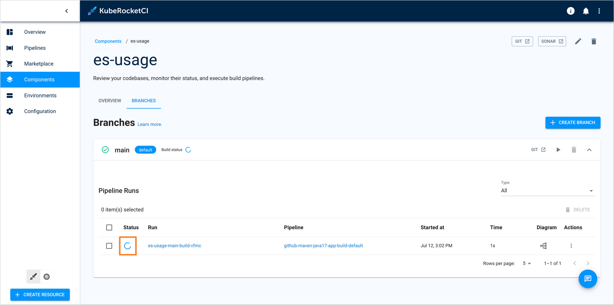

3. Once the build pipeline has successfully completed, navigate to the **Environments** tab and select the `deploy` pipeline. Choose the **SIT** stage and click on the **Configure deploy** button:

    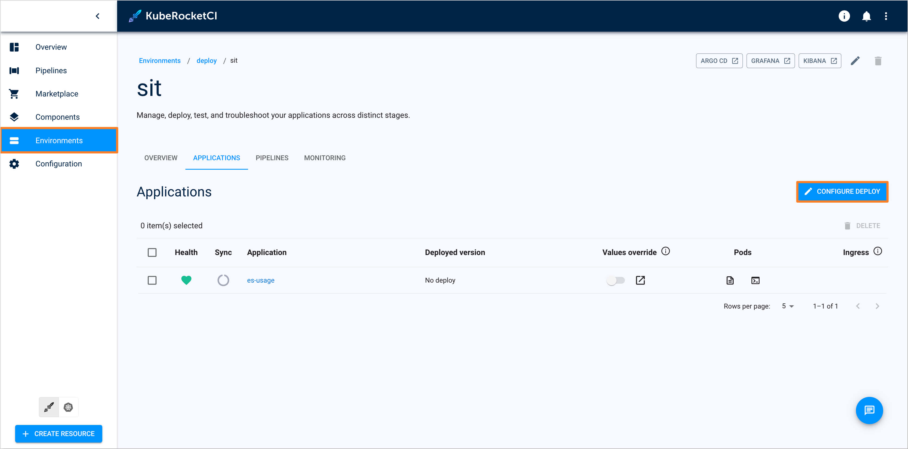

4. In the `Image stream version`, select latest version and push the **Start deploy** button.

    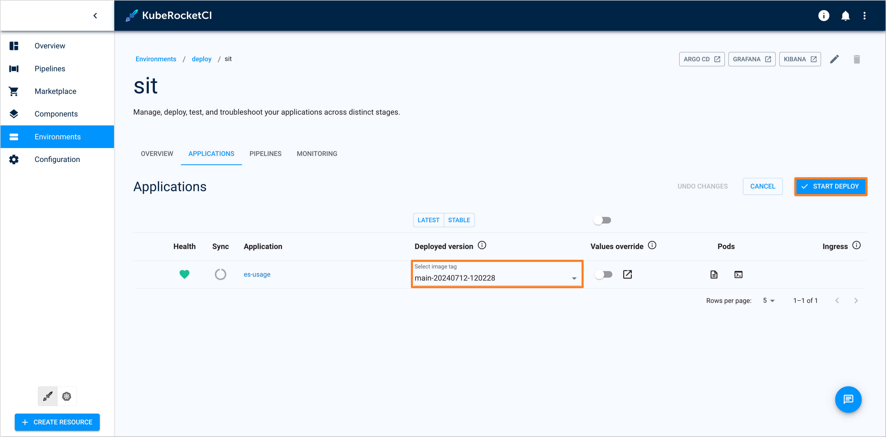

5. Ensure application status is `Healthy` and `Synced`:

    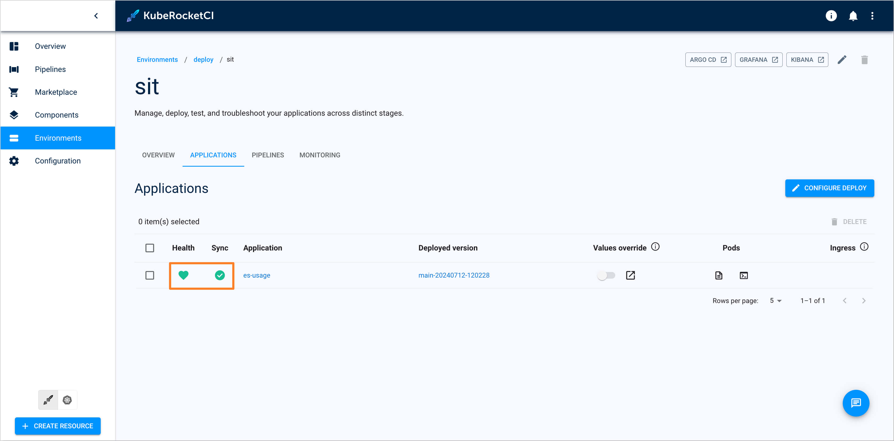

### Check Application Status

To ensure the application is deployed successfully, do the following:

1. Check that the resources are deployed:

    ```bash
    kubectl get secretstore -n demo-deploy-sit
    NAME   AGE     STATUS   CAPABILITIES   READY
    demo   4m38s   Valid    ReadWrite      True
    ```

    ```bash
    kubectl get externalsecret -n demo-deploy-sit
    NAME    STORE   REFRESH INTERVAL   STATUS         READY
    mongo   demo    1h                 SecretSynced   True
    ```

2. In the top right corner, enter the `Account settings` and add `demo-deploy-sit` to the `Allowed namespaces`.

3. Navigate to the **Kubernetes** tab in the bottom left corner, then go to **Configuration** -> **Secrets** and ensure that the `mongo` secret has been successfully created:

    

4. Navigate to **Workloads** -> **Pods** and access the pod for the `es-usage` application, e.g. `es-usage-7fdb577994-pwjps`. Ensure that the environment variables for `mongo` have been successfully applied:

    

## Related Articles

- [Use Cases](./index.md)
- [Add Application](../user-guide/add-application.md)
- [CD Pipeline](../user-guide/add-cd-pipeline.md)
