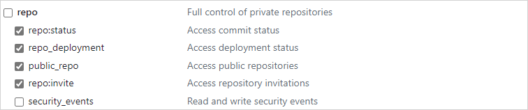
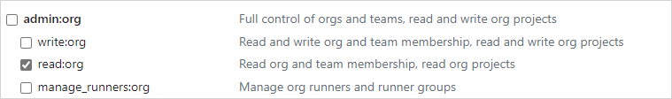
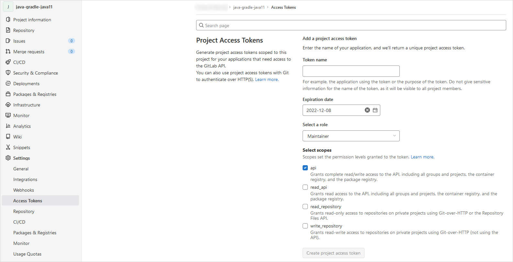
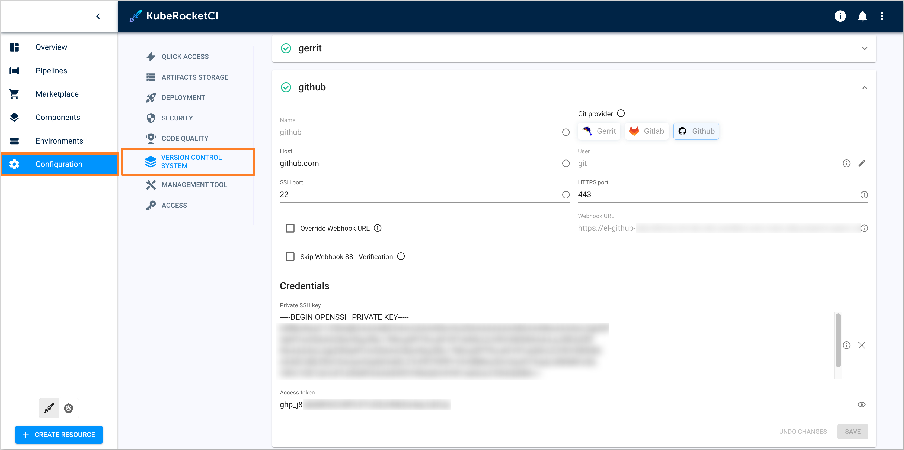

import Tabs from '@theme/Tabs';
import TabItem from '@theme/TabItem';

# Add Git Server

This page describes how to integrate KubeRocketCI with GitLab or GitHub.

<div style={{ display: 'flex', justifyContent: 'center' }}>
<iframe width="560" height="315" src="https://www.youtube.com/embed/pzheGwBLZvU" title="Install KubeRocketCI via Civo" frameborder="0" allow="accelerometer; autoplay; clipboard-write; encrypted-media; gyroscope; picture-in-picture" allowfullscreen="allowfullscreen"></iframe>
</div>

## Integration Procedure

To start from, it is required to add both Secret with SSH key, API token, and GitServer resources by taking the steps below.

1. Generate an SSH key pair and add a public key to [GitLab](https://docs.gitlab.com/ee/ssh/) or [GitHub](https://docs.github.com/en/authentication/connecting-to-github-with-ssh/generating-a-new-ssh-key-and-adding-it-to-the-ssh-agent) account.

    ```bash
    ssh-keygen -t ed25519 -C "email@example.com"
    ```

2. Generate access token for [GitLab](https://docs.gitlab.com/ee/user/profile/personal_access_tokens.html) or [GitHub](https://docs.github.com/en/authentication/keeping-your-account-and-data-secure/creating-a-personal-access-token) account with read/write access to the API. Both personal and project access tokens are applicable.

    <Tabs
      defaultValue="github"
      values={[
        {label: 'GitHub', value: 'github'},
        {label: 'GitLab', value: 'gitlab'}
      ]}>

      <TabItem value="github">
      To create access token in GitHub, follow the steps below:

      * Log in to GitHub.
      * Click the profile account and navigate to **Settings** -> **Developer Settings**.
      * Select *Personal access tokens (classic)* and generate a new token with the following parameters:

      

      :::note
        The access below is required for the codebase operator to setup hooks.
      :::

      
      
      

      :::warning
        Make sure to save a new personal access token because it won`t be displayed later.
      :::
      </TabItem>

      <TabItem value="gitlab">
      To create access token in GitLab, follow the steps below:

      * Log in to GitLab.
      * In the top-right corner, click the avatar and select **Settings**.
      * On the **User Settings** menu, select **Access Tokens**.
      * Choose a name and an optional expiry date for the token.
      * In the **Scopes** block, select the **api** scope for the token.

      

      * Click the **Create personal access token** button.

      :::note
        Make sure to save the access token as there will not be any ability to access it once again.
      :::

      In case you want to create a project access token instead of a personal one, take the following steps:

      * Log in to GitLab and navigate to the project.
      * On the **User Settings** menu, select *Access Tokens*.
      * Choose a name and an optional expiry date for the token.
      * Choose a role: *Owner* or *Maintainer*.
      * In the **Scopes** block, select the *api* scope for the token.

      

      * Click the **Create project access token** button.
      </TabItem>
    </Tabs>

3. Create a secret in the namespace where KubeRocketCI is installed (`edp` by default) for the Git account with the **id_rsa**, **username**, and **token** fields.

    <Tabs
      defaultValue="portal"
      values={[
        {label: 'UI Portal', value: 'portal'},
        {label: 'kubectl', value: 'kubectl'}
      ]}>

      <TabItem value="portal">
      Navigate to **Configuration** -> **Git Servers**. Fill in the required fields:

      
      </TabItem>

      <TabItem value="kubectl">

      :::warning
        Take the following template as an example (for the name use `ci-gitlab` for GitLab and `ci-github` for GitHub):
      :::

      Create a manifest file called `secret.yaml` with the following content filled in:

      ```bash
      kubectl apply -f - <<EOF
        apiVersion: v1
        kind: Secret
        metadata:
          name: ci-github
          namespace: edp
          labels:
            app.edp.epam.com/secret-type: repository
        type: Opaque
        stringData:
          id_rsa: <id_rsa_data>
          username: git
          token: <your_github_access_token>
      EOF

      ```

      </TabItem>
    </Tabs>

As a result, you will be able to create codebases using an integrated Version Control System.

## Related Articles

* [Add Application](add-application.md)
