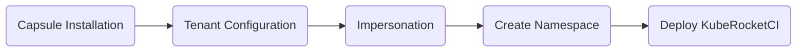

<!-- markdownlint-disable MD025 -->

# Install Capsule

<head>
  <link rel="canonical" href="https://docs.kuberocketci.io/docs/operator-guide/advanced-installation/capsule" />
</head>

This article explains how the KubeRocketCI leverages Capsule capabilities to enable isolation for both the [core](../install-kuberocketci.md) platform components and the business applications [workload](../../user-guide/add-cd-pipeline.md).

KubeRocketCI uses Capsule to ensure resource isolation. It is essential to define constraints through the Capsule tenant approach. This approach serves two primary objectives: limiting the resources allocated to the KubeRocketCI components and regulating the resources utilized by each deployed environment.

To ensure isolation for the core platform components, create the `edp` namespace under the Capsule tenant. Use the template provided in this instruction to create the Capsule tenant specifically for the core components.

## Integration

The following diagram outlines the general steps involved in configuring Capsule for seamless integration with KubeRocketCI. This process ensures efficient resource isolation, allowing for the deployment and management of both KubeRocketCI core platform components and business application workloads.
Follow the sequential flow of the diagram to successfully integrate Capsule with the KubeRocketCI platform:



1. **Capsule Installation** - This initial step involves setting up Capsule on your environment.

2. **Tenant Configuration** - Once Capsule is installed, the next critical step is configuring the Capsule tenant. This involves defining specific parameters and constraints to regulate the allocation of resources to KubeRocketCI components.

3. **Impersonation** - Impersonation plays a role in managing user identities and permissions within the Capsule environment. This step ensures secure and controlled access to resources.

4. **Create Namespace** - The creation of a dedicated namespace under Capsule is crucial for isolating and managing the core components of the platform. This step establishes the environment where KubeRocketCI will be deployed (`edp` by default).

5. **Deploy KubeRocketCI** - The final step involves deploying the platform within the configured Capsule environment.

## Installation

The installation procedure consists of two steps:

1. Define the namespace where KubeRocketCI will be installed in Capsule values:

    ```yaml title="values.yaml"
    manager:
      options:
        # -- Boolean, enforces the Tenant owner, during Namespace creation, to name it using the selected Tenant name as prefix, separated by a dash
        forceTenantPrefix: true
        # enable capsule for KubeRocketCI tenant and cd-pipeline-operator
        # NOTE: Capsule cannot manage cluster system namespaces
        capsuleUserGroups:
          - capsule.clastix.io
          # enable for cd-pipeline-operator https://github.com/epam/edp-cd-pipeline-operator/blob/release/2.17/deploy-templates/values.yaml#L10
          - system:serviceaccounts:edp  # edp - Namespace where KubeRocketCI will be installed.
          - masters                     # Kubernetes group that manages the KubeRocketCI tenant.
          # uncomment if Argo CD manage main KubeRocketCI tenant
          #- system:serviceaccounts:argocd
          # uncomment if edp-oidc-admins group manage main KubeRocketCI tenant
          #- edp-oidc-admins
    ```

2. To install the Capsule tool, use the [Cluster Add-Ons](https://github.com/epam/edp-cluster-add-ons) approach. For more details, please refer to the [Capsule](https://capsule.clastix.io/docs/general) official page.

## Configuration

After installing Capsule, the next crucial step is configuration. Follow the guidelines provided below to configure Capsule and ensure seamless integration with your system:

1. Specify the Capsule tenant configuration:

    ```yaml title="edp-tenant-example.yaml"
    apiVersion: capsule.clastix.io/v1beta2
    kind: Tenant
    metadata:
      name: edp-tenant
    spec:
      ...
      owners:
        - clusterRoles:
            - admin
            - capsule-namespace-manager
          kind: Group
          name: system:masters
        #
        # Uncomment if Argo CD manage KubeRocketCI tenant
        #- clusterRoles:
        #    - admin
        #    - capsule-namespace-manager
        #  kind: ServiceAccount
        #  name: system:serviceaccount:argocd:argocd-application-controller
        #
        # Uncomment if edp-oidc-admins group manage KubeRocketCI tenant
        #- clusterRoles:
        #    - admin
        #    - capsule-namespace-manager
        #  kind: Group
        #  name: edp-oidc-admins
      ...
    ```

    `system:masters` Group that manages the KubeRocketCI tenant. Must be declared in the above configuration of the `capsuleUserGroups`.

    The following example includes additional specifications that can be used to manage the KubeRocketCI tenant:

    :::note Tenant configuration example

      ```yaml
      apiVersion: capsule.clastix.io/v1beta2
      kind: Tenant
      metadata:
        name: edp-tenant
      spec:
        ingressOptions:
          allowWildcardHostnames: false
          allowedHostnames:
            allowedRegex: ^.*example.com$ # DNSwildcard for KubeRocketCI usage
          hostnameCollisionScope: Tenant
        limitRanges:
          items:
            - limits:
                  # The default limits apply to each container unless otherwise specified by default
                - default:
                    cpu: 768m
                    memory: 768Mi
                  # The default requests apply to each container unless otherwise specified by default
                  defaultRequest:
                    cpu: 256m
                    memory: 512Mi
                  type: Container
            - limits:
                # In case Tekton pipelines need to use volume workspaces. If use emptydir please set it to 0.
                - max:
                    storage: 3Gi
                  min:
                    storage: 3Gi
                  type: PersistentVolumeClaim
        # Since EDKubeRocketCIP uses one namespace, the namespace quota is set to 1
        namespaceOptions:
          quota: 1
        networkPolicies:
          items:
            - ingress:
                - from:
                    - namespaceSelector:
                        matchLabels:
                          capsule.clastix.io/tenant: edp-tenant
                    - podSelector: {}
                    - ipBlock:
                        cidr: 172.32.0.0/16
              podSelector: {}
              policyTypes:
                - Ingress
        # Default KubeRocketCI admins group to make admin users tenant owners
        owners:
          - clusterRoles:
              - admin
              - capsule-namespace-manager
            kind: Group
            name: system:masters
          #
          # Uncomment if Argo CD manage main KubeRocketCI tenant
          #- clusterRoles:
          #    - admin
          #    - capsule-namespace-manager
          #  kind: ServiceAccount
          #  name: system:serviceaccount:argocd:argocd-application-controller
          #
          # Uncomment if edp-oidc-admins group manage main KubeRocketCI tenant
          #- clusterRoles:
          #    - admin
          #    - capsule-namespace-manager
          #  kind: Group
          #  name: sandbox-oidc-cluster-admins
        resourceQuotas:
          items:
              # The maximum CPU and Memory capacity for the KubeRocketCI tenant
            - hard:
                limits.cpu: '2'
                limits.memory: 2Gi
              # The maximum number of pods that can be deployed within a namespace
            - hard:
                pods: '15'
          scope: Tenant
        serviceOptions:
          # Enable the capabilities to create ClusterIP service types only
          allowedServices:
            externalName: false
            loadBalancer: false
            nodePort: false
      ```

    :::

2. To install the Capsule tenant, use the [Cluster Add-Ons](https://github.com/epam/edp-cluster-add-ons) approach.

3. [Create namespace](https://capsule.clastix.io/docs/general/tutorial/#create-namespaces) for the KubeRocketCI tenant:

    1. Log in as a `system:masters` member and create a namespace for platform deployment under the Capsule tenant using the following command:

        ```bash
        kubectl create namespace edp
        ```

    2. To ensure that the `edp` namespace is successfully created under the Capsule tenant, you can verify the status of the Capsule tenant using the following command:

        ```bash
        kubectl get tenant edp-tenant -o yaml
        ```

        Expected output:

        ```yaml
        ...
        status:
          namespaces:
          - edp
          size: 1
          state: Active
        ```

4. Enable Capsule in the values.yaml file to make it possible to manage deployable environments:

    ```yaml title="values.yaml"
    cd-pipeline-operator:
      tenancyEngine: "capsule"
    ```

By following these instructions, Capsule policies are utilized to manage the KubeRocketCI core components and deployable environments. By adhering to these guidelines, you should successfully install KubeRocketCI with Capsule enabled as the `tenancyEngine`.

## Related Articles

* [Install KubeRocketCI With Values File](../install-kuberocketci.md)
* [Cluster Add-Ons Overview](../add-ons-overview.md)
