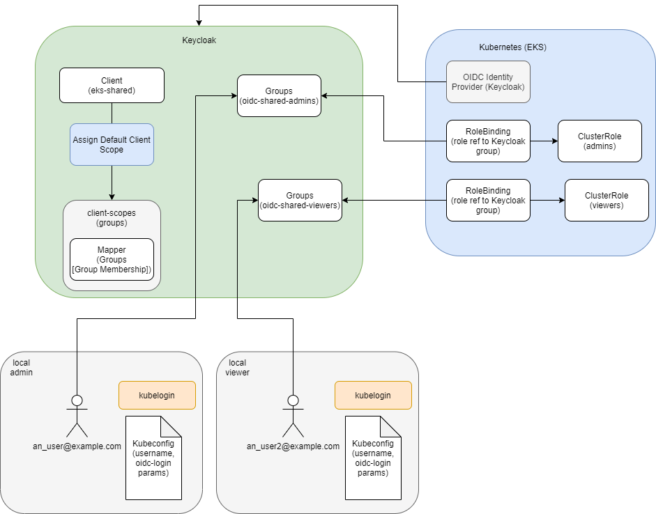
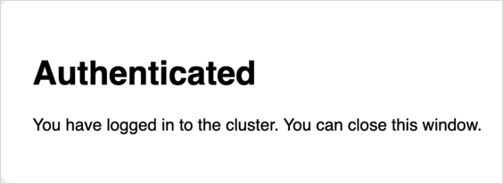

import Tabs from '@theme/Tabs';
import TabItem from '@theme/TabItem';

# EKS OIDC With Keycloak

This article provides the instruction of configuring Keycloak as [OIDC Identity Provider](https://aws.amazon.com/blogs/containers/introducing-oidc-identity-provider-authentication-amazon-eks/) for EKS.
The example is implemented following the KubeRocketCI add-ons approach.

## Prerequisites

To follow the instruction, check the following prerequisites:

1. (Optional) Terraform version 1.5.7
2. Kubelogin version >= v1.25.1
3. (Optional) [EDP Cluster Add-ons](../add-ons-overview.md) Solution is applied
4. (Optional) [External Secrets Operator](https://github.com/epam/edp-cluster-add-ons/tree/main/add-ons/external-secrets)
5. A running [Keycloak instance](https://github.com/epam/edp-cluster-add-ons/tree/main/add-ons/keycloak)
6. The [Keycloak operator](https://github.com/epam/edp-cluster-add-ons/tree/main/add-ons/keycloak-operator) is deployed
7. The Keycloak Realm's OIDC discovery URL and jwks_uri endpoints are publicly accessible

:::note
  To connect OIDC with a cluster, install and configure the [kubelogin](https://github.com/int128/kubelogin) plugin. For Windows, it is recommended to download the kubelogin as a binary and add it to your PATH.
:::

## Solution Overview

This architecture encompasses three primary resource types: AWS (EKS), Keycloak, and Kubernetes.
Within this setup, the Keycloak resources, once established, remain static, facilitating the assignment of claims based on user group memberships. This stability contrasts with the dynamic nature of other resources, which may be created, modified, or deleted as necessary.
Of particular importance within the Kubernetes ecosystem are the `RoleBindings` and `ClusterRoles/Roles`. These elements define a permissions framework, where Roles specify the permissions available, and RoleBindings serve to associate those Roles with specific Keycloak groups. This association ensures that members of a group are granted only the permissions that are pertinent to their role.



## Keycloak Configuration

The initial step involves setting up the Keycloak operator (configure connections to the Keycloak instance) and along creation its associated resources, including realms, clients, roles, and groups.

1. Create user with [necessary](keycloak.md#configuration) privileges to Keycloak:

    <Tabs
      defaultValue="eso"
      values={[
        {label: 'External Secret Operator', value: 'eso'},
        {label: 'Manual', value: 'manual'}
      ]}>

      <TabItem value="eso">
        Store user credentials in AWS Parameter Store:

        ```json title="AWS Parameter Store"
        {
          "keycloak": {
            "username": "<KEYCLOAK_USERNAME>",
            "password": "<KEYCLOAK_PASSWORD>"
          }
        }
        ```
      </TabItem>

      <TabItem value="manual">
        Deactivate the External Secret Operator within the primary [kuberocketci-rbac](https://github.com/epam/edp-cluster-add-ons/blob/main/add-ons/kuberocketci-rbac/values.yaml#L27) chart:

        ```yaml title="values.yaml"
        # Configure components of the External Secrets Operator (ESO).
        eso:
          # -- Install components of the ESO.
          enabled: false
        ```

        Create secret with user credentials:
        ```bash
        kubectl create secret generic keycloak \
          --from-literal=username=<KEYCLOAK_USERNAME> \
          --from-literal=password=<KEYCLOAK_PASSWORD>
        ```
      </TabItem>
    </Tabs>

2. Begin by installing the [**kuberocketci-rbac**](https://github.com/epam/edp-cluster-add-ons/tree/main/add-ons/kuberocketci-rbac) add-on. This can be accomplished through the use of the add-ons method, as detailed in the [addons approach](../add-ons-overview.md). Utilize the following values in the `values.yaml` file:

    ```yaml title="values.yaml"
    keycloakUrl: "https://example.com"
    # -- This block enable the creation of Keycloak operator resources for the
    # EKS OIDC configuration, such as client, client scope, and realm groups.
    kubernetes:
      enabled: true
    ```

3. Activate the [**kuberocketci-rbac**](https://github.com/epam/edp-cluster-add-ons/blob/main/chart/values.yaml#L58) add-on within the application settings:

    ```yaml title="values.yaml"
    kuberocketci-rbac:
      createNamespace: true
      enable: true
    ```


This add-ons facilitates sets up a broker realm to manage traffic redirection between external Identity Providers (IdP) and internal clients. Additionally, it creates a shared realm that encompasses all clients, including to EKS, Sonar, Nexus, and Portal.

The [KubeRocketCI RBAC add-on](https://github.com/epam/edp-cluster-add-ons/tree/main/add-ons/kuberocketci-rbac) creates Keycloak groups that are used in the KubeRocketCI platform to manage access to resources. For more details refer to the [KubeRocketCI Groups](platform-auth-model.md#groups) documentation.

## AWS Configuration

Configure Identity provider in kubernetes cluster

    <Tabs
      defaultValue="terraform"
      values={[
        {label: 'Terraform', value: 'terraform'},
        {label: 'AWS Console UI', value: 'aws'}
      ]}>

      <TabItem value="terraform">
        For integrating OpenID Connect (OIDC) with Amazon EKS through terraform, it's essential to update the EKS module within your terraform repository. The relevant repository can be found at KubeRocketCI's [terraform-aws-platform](https://github.com/KubeRocketCI/terraform-aws-platform/tree/master/eks). Adjust the module by incorporating the following configuration in the `eks/template.tfvars` file:

        ```json title="eks/template.tfvars"
        # OIDC Identity provider configuration
        cluster_identity_providers = {
          keycloak = {
            client_id = "eks"
            issuer_url = "https://example.com/auth/realms/shared"
            groups_claim = "groups"
          }
        }
        ```

        This configuration snippet specifies the Keycloak as the OIDC Identity Provider for your EKS cluster. It includes the client ID (`eks`), the issuer URL (pointing to the Keycloak realm), and the claim used for groups (`groups`). This setup ensures that authentication and authorization mechanisms for accessing the EKS cluster are correctly configured to use Keycloak as the identity provider.

      </TabItem>

      <TabItem value="aws">
        The objective is to configure an Identity Provider within your Kubernetes cluster. The process involves several steps within the AWS Management Console:

        1. Begin by opening the AWS Management Console.
        2. Navigate to the Elastic Kubernetes Service (EKS) section.
        3. Select your specific **Cluster name**.
        4. Go to the **Access** tab, then find and select the **OIDC identity providers** section.
        5. Click on **Associate identity provider**.

        When associating the identity provider, ensure you input the following details:

        ```text
        Issuer URL: https://example.com/auth/realms/shared
        Client ID: eks
        Groups Claim: groups
        ```
      </TabItem>
    </Tabs>

## Kubeconfig

Template for kubeconfig:

```yaml
apiVersion: v1
preferences: {}
kind: Config

clusters:
- cluster:
    server: https://<eks_url>.eks.amazonaws.com
    certificate-authority-data: <certificate_authority_data>
  name: eks

contexts:
- context:
    cluster: eks
    user: <keycloak_user_email>
  name: eks

current-context: eks

users:
- name: <keycloak_user_email>
  user:
    exec:
      apiVersion: client.authentication.k8s.io/v1beta1
      command: kubectl
      args:
      - oidc-login
      - get-token
      - -v1
      - --oidc-issuer-url=https://<keycloak_url>/auth/realms/shared
      - --oidc-client-id=eks
      - --oidc-client-secret=<keycloak_client_secret>
```

Flag `-v1` can be used for debug, in a common case it's not needed and can be deleted.

To find the client secret:

1. Open Keycloak
2. Choose **Shared realm**
3. Find **eks** keycloak client
4. Open Credentials tab
5. Copy Secret

## Access Validation

To validate access to the Kubernetes cluster by using the default **cluster-admin** role. Assign the user the **oidc-cluster-admins** Keycloak group.

To add a user to a Keycloak group, follow these steps:

1. Open Keycloak
2. Choose **Shared** realm
3. Open user screen with search field
4. Find a user and open the configuration
5. Open Groups tab
6. In Available Groups, choose an **oidc-cluster-admins** group
7. Click the **Join** button
8. The group should appear in the User's Group Membership list

As a result, the required access mapping is implemented using the following resources:

| Keycloak Group Name  | Kubernetes ClusterRole | Kubernetes ClusterRoleBinding |
|----------------------|-------------------------|-------------------------------|
|  [oidc-cluster-admins](https://github.com/epam/edp-cluster-add-ons/blob/main/add-ons/kuberocketci-rbac/templates/kubernetes/keycloak-realmgroups-cluster-admins.yaml) | cluster-admin (built-in)           | [cluster-admin](https://github.com/epam/edp-cluster-add-ons/blob/main/add-ons/kuberocketci-rbac/templates/kubernetes/clusterrolebinding-admin.yaml)                 |

In this configuration, the Keycloak **oidc-cluster-admins** group is mapped to the Kubernetes **cluster-admin** role. This setup grants members of the **oidc-cluster-admins** group the necessary permissions to perform administrator management in the Kubernetes cluster. You can further customize access by associating different Keycloak groups with specific Kubernetes roles.

KubeRocketCI follows the same approach for managing access to its resources. For more information, refer to the [KubeRocketCI Groups](platform-auth-model.md#groups) documentation.

Follow the steps below to test the configuration:

* Run kubectl command, it is important to specify the correct kubeconfig:

  ```bash
  KUBECONFIG=<path_to_oidc_kubeconfig> kubectl get ingresses -n <namespace_name>
  ```

* After the first run and redirection to the Keycloak login page, log in using credentials (login:password) or using SSO Provider.
In case of the successful login, you will receive the following notification that can be closed:

  

* As the result, a respective response from the Kubernetes will appear in the console
in case a user is configured correctly and is a member of the correct group and Roles/RoleBindings.

* If something is not set up correctly, the following output error will be displayed:

  ```bash
  Error from server (Forbidden): ingresses.networking.k8s.io is forbidden:
  User "https://<keycloak_url>/auth/realms/shared#<keycloak_user_id>"
  cannot list resource "ingresses" in API group "networking.k8s.io" in the namespace "<namespace_name>"
  ```

## Session Update

To update the session, clear cache.
The default location for the login cache:

```bash
rm -rf ~/.kube/cache
```

## Access Cluster via Lens

To access the Kubernetes cluster via [Lens](https://k8slens.dev/), follow the steps below to configure it:

* Add a new kubeconfig to the location where Lens has access. The default location of the kubeconfig is **~/.kube/config** but it can be changed by navigating to **File** -> **Preferences** -> **Kubernetes** -> **Kubeconfig Syncs**;
* (Optional) Using Windows, it is recommended to reboot the system after adding a new kubeconfig;
* Authenticate on the Keycloak login page to be able to access the cluster.

:::note
  Lens does not add namespaces of the project automatically, so it is necessary to add them manually, simply go to **Settings** -> **Namespaces** and add the namespaces of a project.
:::

## Changing the Lifespan of an Access Token

By default, the Keycloak token has a lifespan of 5 minutes. To modify this duration refer to the guidelines outlined in this [document](ui-portal-oidc#changing-the-lifespan-of-an-access-token).

## Related Articles

* [Headlamp OIDC Configuration](ui-portal-oidc.md)
