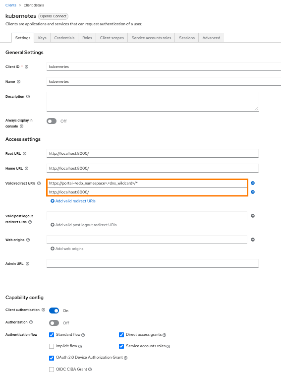
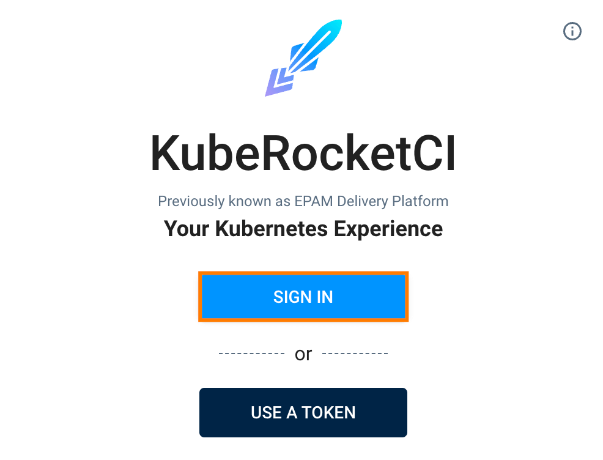
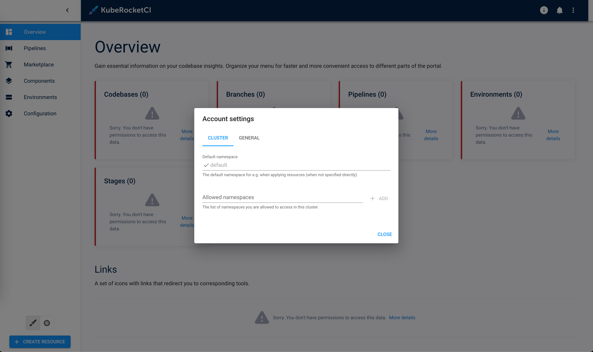

<!-- markdownlint-disable MD025 -->

# Portal OIDC Configuration

<head>
  <link rel="canonical" href="https://docs.kuberocketci.io/docs/operator-guide/auth/ui-portal-oidc" />
</head>

This page provides instructions for configuring the [OIDC authorization](https://openid.net/connect/) for the KubeRocketCI [Portal UI](../../user-guide/index.md), enabling the use of Single Sign-On (SSO) for authorization in the Portal. This configuration allows for centralized control of user access and rights from a single configuration point.

## Prerequisites

Ensure the following values are set first before starting the Portal OIDC configuration:

1. `realm_id`  = **shared**

2. `client_id` = **eks**

3. `keycloak_client_key`= **keycloak_client_secret_key** (received from: `Shared realm` -> `clients` -> `eks` -> `Credentials` -> `Client secret`)

:::note
  The values indicated above are the result of the Keycloak configuration as an OIDC identity provider.
  To obtain these values, please refer to the guidelines on the [Keycloak OIDC EKS Configuration](configure-keycloak-oidc-eks.md) page.
:::

## Configure Keycloak

To proceed with the Keycloak configuration, perform the following:

1. Add the URL of the Headlamp to the `valid_redirect_uris` variable in [Keycloak](https://github.com/epam/edp-cluster-add-ons/blob/main/clusters/core/addons/kuberocketci-rbac/templates/kubernetes/keycloak-client.yaml#L17):

    :::note keycloak_openid_client

      ```yaml
        redirectUris:
          - "https://portal.<dns_wildcard>/*"
          - "http://localhost:8000/*"
      ```

    :::

    Make sure to define the following Keycloak client values as indicated:

    

2. Configure the Keycloak client key in Kubernetes using the Kubernetes secrets or the [External Secrets Operator](../secrets-management/external-secrets-operator-integration.md):

    ```yaml
    apiVersion: v1
    kind: Secret
    metadata:
      name: keycloak-client-headlamp-secret
      namespace: krci
    type: Opaque
    stringData:
      clientSecret: <keycloak_client_secret_key>
    ```

3. Assign user to one or more groups in Keycloak.

## Integrate Portal With Kubernetes

Portal is integrated in Kubernetes in three steps:

1. Update the [values.yaml](../install-kuberocketci.md) file by enabling OIDC:

    :::note values.yaml

      ```yaml
      edp-headlamp:
        config:
          oidc:
            enabled: true
      ```

    :::

2. Navigate to Portal UI and log in by clicking the `Sign In` button:

    

3. Upon logging in, specify the namespace for KubeRocketCI where platform is deployed by clicking the cluster settings link in the bottom left corner of the UI:

    

As a result, it is possible to control access and rights from the Keycloak endpoint.

## Changing the Lifespan of an Access Token

Change the Access Token Lifespan: go to your Keycloak and select *Openshift realm* > *Realm settings* > *Tokens* >
*Access Token Lifespan* > set a new value to the field and save this change.

By default, "Access Token Lifespan" value is 5 minutes.


## Related Articles

* [EKS OIDC With Keycloak](configure-keycloak-oidc-eks.md)
* [External Secrets Operator](../secrets-management/external-secrets-operator-integration.md)
