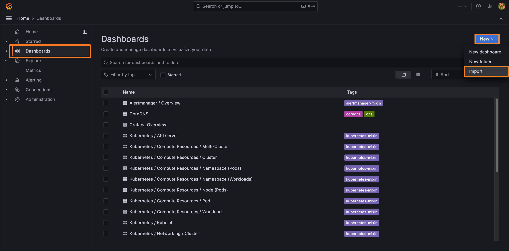
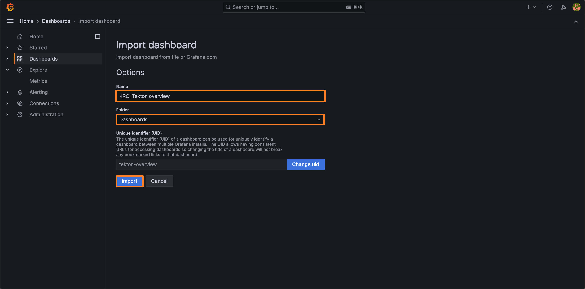
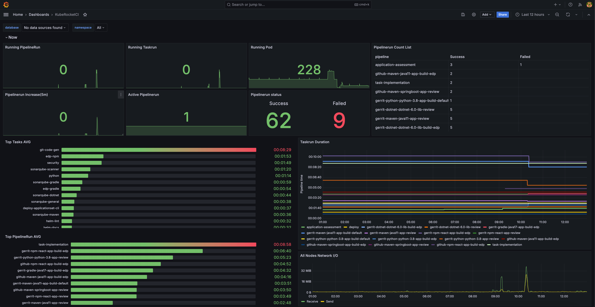

# Pipeline Monitoring with Prometheus and Grafana

<head>
  <link rel="canonical" href="https://docs.kuberocketci.io/docs/operator-guide/ci/tekton-monitoring/" />
</head>

This documentation describes how to integrate tekton-pipelines metrics with Prometheus and Grafana monitoring stack.

## Prerequisites

Ensure the following requirements are met first before moving ahead:

* [Kube prometheus stack](https://prometheus-community.github.io/helm-charts) is installed;
* [Tekton pipeline](https://github.com/tektoncd/pipeline/releases) is installed.

## Integration via Service Monitor

To implement Pipeline Monitoring using the Service Monitor resource, follow the steps below:

1. Create a Service Monitor resource file with the following configuration:

    ```yaml service-monitor.yaml
    apiVersion: monitoring.coreos.com/v1
    kind: ServiceMonitor
    metadata:
      labels:
        release: prom               # kube-prometheus-stack release name
      name: tekton-overview
    spec:
      endpoints:
        - interval: 10s
          path: /metrics
          port: http-metrics
          scrapeTimeout: 10s
      namespaceSelector:
        matchNames:
          - tekton-pipelines
      selector:
        matchLabels:
          app.kubernetes.io/component: controller
          app.kubernetes.io/part-of: tekton-pipelines
    ```

2. Apply the created resource to the `tekton-pipelines` namespace:

    ```bash
    kubectl apply -f service-monitor.yaml -n tekton-pipelines
    ```

3. Download the [KubeRocketCi](https://grafana.com/grafana/dashboards/18321) dashboard:

    a. Click on the dashboard menu;

    b. In the upper right corner, click on the `New` button. In the dropdown menu, click the `Import`;

    

    c. Select the downloaded `18321_rev*.json` file;

    

    d. Type the name of the dashboard;

    e. Select the folder for the dashboard;

    f. Change the UID if necessary;

    g. Click the `Import` button.

As soon as the dashboard procedure is completed, you can track the newcoming metrics in the dashboard menu:

    

## Related Articles

* [Install Tekton](../install-tekton.md)
* [Install KubeRocketCI](../install-kuberocketci.md)
