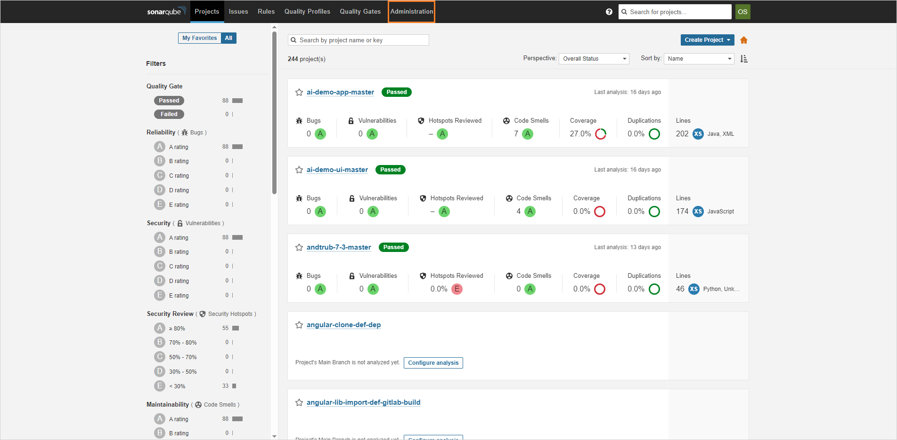
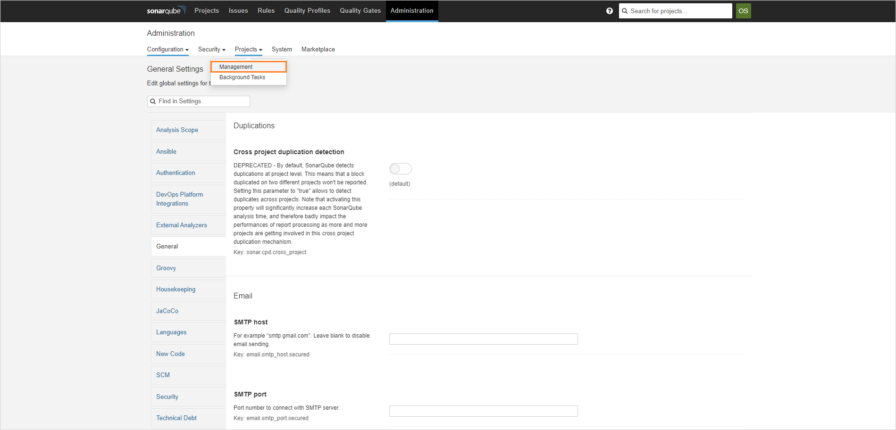
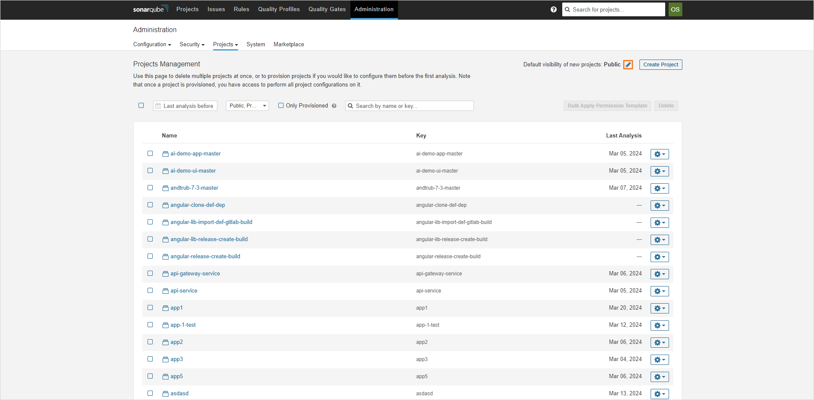
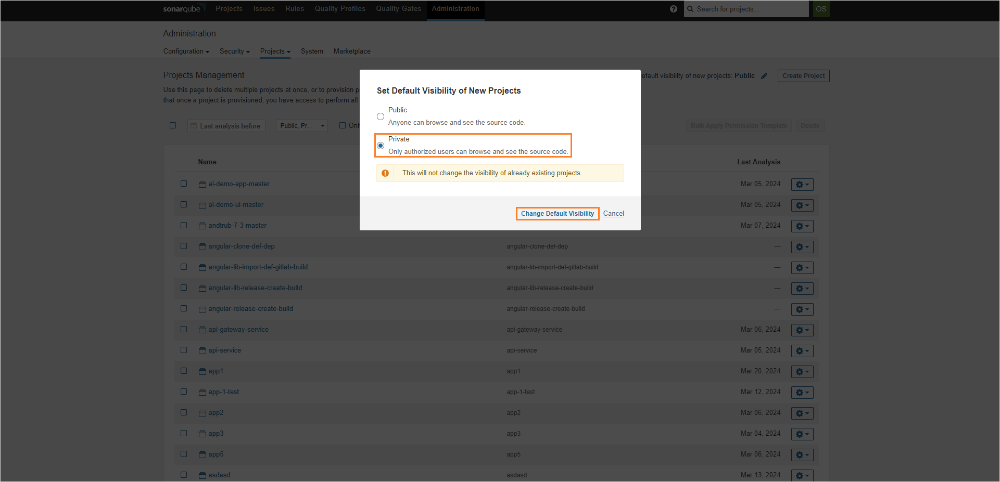
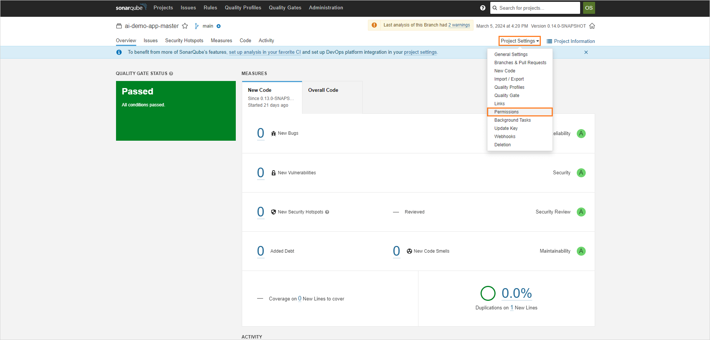
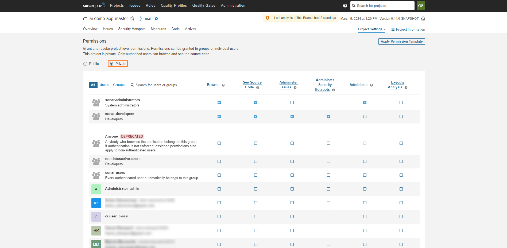

<!-- markdownlint-disable MD025 -->

# Manage Project Visibility

<head>
  <link rel="canonical" href="https://docs.kuberocketci.io/docs/operator-guide/code-quality/sonarqube-visibility/" />
</head>

This manual offers detailed guidance on configuring permissions for SonarQube projects, ensuring that only authorized personnel can access and interact with the data on the SonarQube platform. It caters to both new and existing SonarQube projects, providing a clear pathway to refine visibility settings for enhanced security.

By leveraging the OpenID Connect mechanism for login, users are automatically assigned to the `sonar-users` group, granting them access to all projects by default. This document outlines methods to alter these default permissions, enhancing the platform's security and data confidentiality. It is structured into two main sections: one focusing on [restricting access to new projects](#restrict-access-for-new-projects), and the other on [reconfiguring access settings for existing projects](#configure-access-for-existing-projects).

## Restrict Access for New Projects

In its default configuration, SonarQube does not restrict access to newly created projects, making them accessible to all instance users. To modify this behavior and set new projects to private by default, follow these instructions:

1. Open the SonarQube UI in the browser.

2. Navigate to the `Administration` tab:

    

    :::note
      Ensure you have admin rights to see the `Administration` section.
    :::

3. Click the `Projects` button and select `Management`:

    

4. On the project management page, click pencil icon at the top-right corner::

    

5. Select **Private** and click **Change Default Visibility**:

    

## Configure Access for Existing Projects

To make all the current projects private, follow the steps below:

1. In the **Projects** tab, enter the project you want to make private.

2. In the project page, click the **Project Settings** button and select **Permissions**:

    

3. In the project permissions page, select **Private**:

    

4. Repeat the procedure for all of the projects you want to make private.

## Related Articles

* [SonarQube Integration](sonarqube.md)
* [Nexus Sonatype Integration](../artifacts-management/nexus-sonatype.md)
* [Integrate SonarQube](../../quick-start/integrate-sonarcloud.md)
