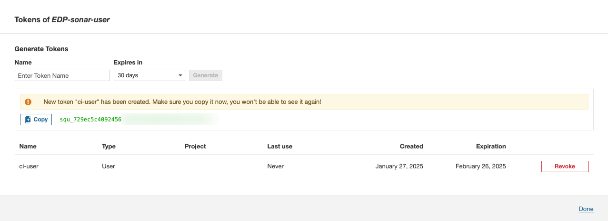

import Tabs from '@theme/Tabs';
import TabItem from '@theme/TabItem';

# SonarQube Integration

<head>
  <link rel="canonical" href="https://docs.kuberocketci.io/docs/operator-guide/code-quality/sonarqube/" />
</head>

This documentation offers detailed guidance on seamlessly integrating SonarQube into KubeRocketCI.
It covers essential steps to ensure a robust connection between SonarQube's code quality and security
analysis capabilities with the platform's continuous delivery ecosystem,
facilitating enhanced code inspection and improvement practices within your development workflow.

<div style={{ display: 'flex', justifyContent: 'center' }}>
<iframe width="560" height="315" src="https://www.youtube.com/embed/0duxqmIKFpQ" title="SonarQube Integration" frameborder="0" allow="accelerometer; autoplay; clipboard-write; encrypted-media; gyroscope; picture-in-picture" allowfullscreen="allowfullscreen"></iframe>
</div>

## Prerequisites

Before proceeding, ensure the following prerequisites are in place:

* Kubectl version 1.26.0+ is installed. Please refer to the [Kubernetes official website](https://kubernetes.io/releases/download/) for details.
* [Helm](https://helm.sh) version 3.14.0+ is installed. Please refer to the [Helm page](https://github.com/helm/helm/releases) on GitHub for details.

## Installation

To install SonarQube in environment, it's recommended to use the resources provided in the [Cluster Add-Ons](https://github.com/epam/edp-cluster-add-ons) repository. This approach involves installing both the sonarqube and the [sonar-operator](https://github.com/epam/edp-sonar-operator). Leveraging the Cluster Add-Ons simplifies the deployment and management process, providing a streamlined method to integrate SonarQube into infrastructure.

1. Navigate to the forked cluster Add-Ons repository and align the [sonar values.yaml](https://github.com/epam/edp-cluster-add-ons/tree/main/clusters/core/addons/sonar/values.yaml) and [sonar-operator values.yaml](https://github.com/epam/edp-cluster-add-ons/tree/main/clusters/core/addons/sonar-operator/values.yaml) files. Follow the instructions to deploy sonarqube, ensuring it's correctly configured to serve as artifact repository.

2. Update the configuration to enable **sonar** and **sonar-operator** in [Add-Ons](https://github.com/epam/edp-cluster-add-ons/blob/main/clusters/core/apps/values.yaml) repository:

    ```yaml title="clusters/core/apps/values.yaml"
    sonar:
      createNamespace: true
      enable: true

    sonar-operator:
      createNamespace: true
      enable: true
    ```

3. Sync resources and wait till the all **sonar** and **sonar-operator** resources is created:

    

4. **Sign In** into **sonarqube** using the default credentials **Username**: `admin` and **Password**: `admin` and update the default password for better security for that click on profile icon in the upper right corner, click on **Security**, enter a new password and click **Update** button:

    

### Applying GitOps approach installation changes

To update SonarQube configurations:

1. Modify the relevant configuration files in the forked add-ons repository.
2. Commit and push the changes to the forker Git repository.
3. Synchronize the changes with ArgoCD.

## Configuration

With Add-ons approach add predefined [SonarQube plugins](https://github.com/epam/edp-cluster-add-ons/blob/build/0.1.0-SNAPSHOT.236/clusters/core/addons/sonar/values.yaml#L26) and [sonar-operator](https://github.com/epam/edp-cluster-add-ons/tree/build/0.1.0-SNAPSHOT.236/clusters/core/addons/sonar-operator/templates/sonar) create the necessary groups, users, permission templates, quality profiles, quality gates automatically by deploy preconfigured custom resources. Manage these configurations centrally through a GitOps-based workflow.

## Configuration SonarQube with sonar-operator

1. Create a Kubernetes Secret that the **sonar-operator** will use to connect to the **sonarqube** and create all resources:

  <Tabs
    defaultValue="manifests"
    values={[
      {label: 'Manifests', value: 'manifests'},
      {label: 'External Secrets Operator', value: 'externalsecret'},
    ]}>
    <TabItem value="manifests">
      ```yaml
      apiVersion: v1
      kind: Secret
      metadata:
        name: sonar-admin-password
        namespace: sonar
      type: Opaque
      data:
        user: YWRtaW4=     # base64-encoded value of "admin"
        password: cGFzcw== # base64-encoded value of "pass"
      ```
    </TabItem>
    <TabItem value="externalsecret">
      ```json
      "sonarqube":
      {
        "user": "XXXXXXX",
        "password": "XXXXXXX"
      }
      ```
      </TabItem>
  </Tabs>

2. Create a secret using `manifests` or with `External Secrets Operator` to enable the **sonar-operator** to connect to the **sonarqube** for provisioning:

  <Tabs
    defaultValue="manifests"
    values={[
      {label: 'Manifests', value: 'manifests'},
      {label: 'External Secrets Operator', value: 'externalsecret'},
    ]}>
    <TabItem value="manifests">
      ```yaml
      apiVersion: v1
      kind: Secret
      metadata:
        name: ci-sonar
        namespace: sonar
      type: Opaque
      stringData:
        password: <sonar-ci-password>
      ```
    </TabItem>
    <TabItem value="externalsecret">
      ```json
      "sonarqube-ci-user":
      {
        "password": "XXXXXXX"
      }
      ```
      </TabItem>
  </Tabs>

## SonarQube configuration overview with sonar-operator

### Plugin Management

The SonarQube instance includes pre-installed plugins to meet common project needs. Additional plugins, if required, can be installed by updating the [SonarQube values.yaml](https://github.com/epam/edp-cluster-add-ons/blob/build/0.1.0-SNAPSHOT.236/clusters/core/addons/sonar/values.yaml#L26) file in the forked add-ons repository.

### Group Permissions

Access control in SonarQube is organized through predefined groups:

* **sonar-administrators:** System administrators with full access to manage the instance.
* **sonar-developers:** Developers who can view and edit project settings (managed by the Sonar Operator).
* **sonar-users:** Default group for all authenticated users with basic project viewing rights.
* **view-group:** Grants browsing access for users requiring read-only permissions.

    

### Permission Templates

Permissions in SonarQube are associated with projects through permission templates:

* **edp-default:** The default template applied to all projects, ensuring consistent group-level access management across the platform.

### Quality Gates

Quality Gates are used to ensure that code quality standards are met before further development or deployment proceeds:

* **EDP way (default):** KuberocketCI quality gates are defined in the SonarQube instance, specifically tailored for the KubeRocketCI project.
* **Sonar way (built-in):** These are predefined quality gates available directly in SonarQube, not customized for any specific project but rather standardized for general use.

    

### Quality Profiles

Quality Profiles define the rules used during code analysis. The Sonar Operator manages quality profiles with the following default setup:
* **EDP way (default):** A Java quality profile based on KubeRocketCI best practices, offering tailored rule sets.

## Configuration SonarQube ci-user without sonar-operator

To establish robust authentication and precise access control, generating a SonarQube token is essential. This token is a distinct identifier, enabling effortless integration between SonarQube and KubeRocketCI. To generate the SonarQube token, proceed with the following steps:

1. Open the SonarQube UI and navigate to **Administration** -> **Security** -> **User**. Create a new user or select an existing one. Click the `Options List` icon to create a token:

    

2. Type the `ci-user` username, define an expiration period, and click the `Generate` button to create the token:

    

3. Click the `Copy` button to copy the generated `<Sonarqube-token>`:

    

## Integration SonarQube with KubeRocketCI

For provision secret using manifest, KubeRocketCI portal or with the externalSecrets operator:

<Tabs
  defaultValue="kuberocketci"
  values={[
    {label: 'KubeRocketCI portal', value: 'kuberocketci'},
    {label: 'Manifests', value: 'manifests'},
    {label: 'External Secrets Operator', value: 'externalsecret'},
  ]}>

  <TabItem value="kuberocketci">
  Go to the **Portal** open **Configuration** -> **CODE QUALITY** -> **SONARQUBE**. Update or click **+ ADD INTEGRATION** fill in the `URL` and `Token` fields and click the `Save` button:

  
  </TabItem>

  <TabItem value="manifests">

  ```yaml
  apiVersion: v1
  kind: Secret
  metadata:
    name: ci-sonarqube
    namespace: edp
    labels:
      app.edp.epam.com/secret-type: sonar
      app.edp.epam.com/integration-secret: "true"
  type: Opaque
  stringData:
    url: https://sonarqube.example.com
    token: <sonarqube-token>
  ```

  </TabItem>

  <TabItem value="externalsecret">

  ```json
  "ci-sonarqube":
  {
    "url": "https://sonarqube.example.com",
    "token": "XXXXXXXXXXXX"
  },
  ```

  Go to the **Portal** open **Configuration** -> **CODE QUALITY** -> **SONARQUBE** and see the `Managed by External Secret` message:

  

  More details about External Secrets Operator integration can be found in the [External Secrets Operator Integration](https://epam.github.io/edp-install/operator-guide/code-quality/external-secrets-operator-integration/) page.
  </TabItem>

</Tabs>

## Project Analysis Flow

1. SonarQube analysis is seamlessly integrated into KubeRocketCI pipelines, triggered during both review and build pipelines:

* **Review Pipeline:** Analyzes only the changes made in a pull request.
* **Build Pipeline:** Analyzes the main branch codebase to ensure overall project quality.

2. SonarQube projects are named based on the corresponding KubeRocketCI project names, making it easy to navigate analysis results in the SonarQube UI mode details how to configure repo [project-project.settings](../../user-guide/application-sonarqube-project-properties.md):

    

## Related Articles

* [Sonarqube Project Properties for Application](../../user-guide/application-sonarqube-project-properties.md)
* [Install KubeRocketCI With Values File](../install-kuberocketci.md)
* [Install External Secrets Operator](../secrets-management/install-external-secrets-operator.md)
* [External Secrets Operator Integration](../secrets-management/external-secrets-operator-integration.md)
* [Cluster Add-Ons Overview](../add-ons-overview.md)
