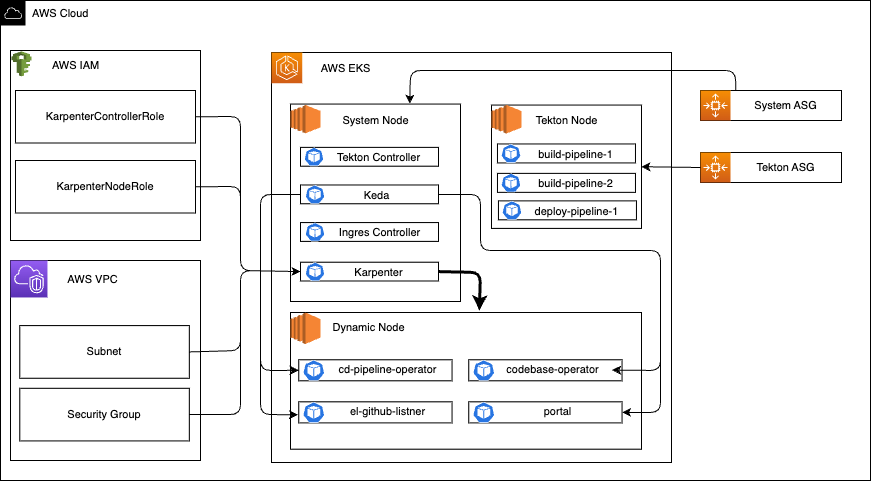

---

title: "Kubernetes Cluster Scaling"
description: "Explore KubeRocketCI's dynamic scaling solution for Kubernetes clusters, utilizing Karpenter for node scaling and KEDA for pod scaling to optimize performance and costs."
sidebar_label: "Overview"

---
<!-- markdownlint-disable MD025 -->

# Kubernetes Cluster Scaling

<head>
  <link rel="canonical" href="https://docs.kuberocketci.io/docs/operator-guide/kubernetes-cluster-scaling/overview/" />
</head>

KubeRocketCI provides a solution for dynamically scaling pods and nodes in a Kubernetes cluster. This approach ensures resources are provisioned based on demand, reducing latency and optimizing costs. By automatically adjusting capacity, the cluster remains responsive to workload fluctuations, improving performance during peak loads while minimizing resource waste during low activity.

This solution enhances reliability by preventing resource shortages, supports high availability by efficiently distributing workloads, and simplifies infrastructure management by automating scaling decisions.

## Architecture Overview

For automatic scaling, two tools are used:

- **Karpenter** – dynamically manages node scaling in the cluster, creating new instances as the load increases and removing resources when demand decreases.
- **KEDA** – adjusts the number of pods based on workload, ensuring flexibility and optimal resource utilization.

The diagram below illustrates the AWS EKS cluster architecture, including key components, dependencies, and scaling mechanisms:

- **System Node** – contains control components such as Tekton Controller, KEDA, Ingress Controller, and Karpenter.
- **Tekton Node** – runs CI/CD pipelines.
- **Dynamic Node** – hosts operators and services that are scaled by Karpenter.
- **Auto Scaling Groups (ASG)** – manage system and Tekton nodes.

This approach ensures efficient resource allocation, reduces latency, and optimizes costs. 🚀

