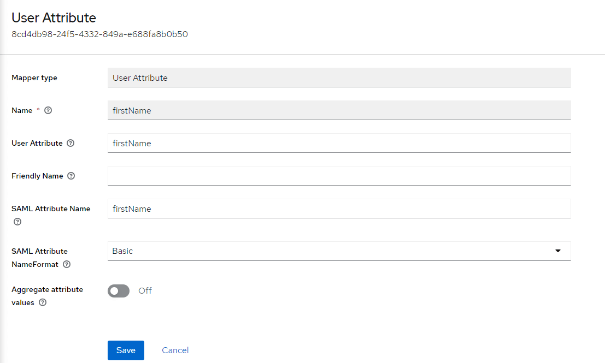
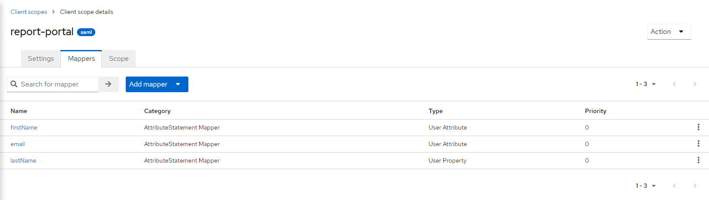
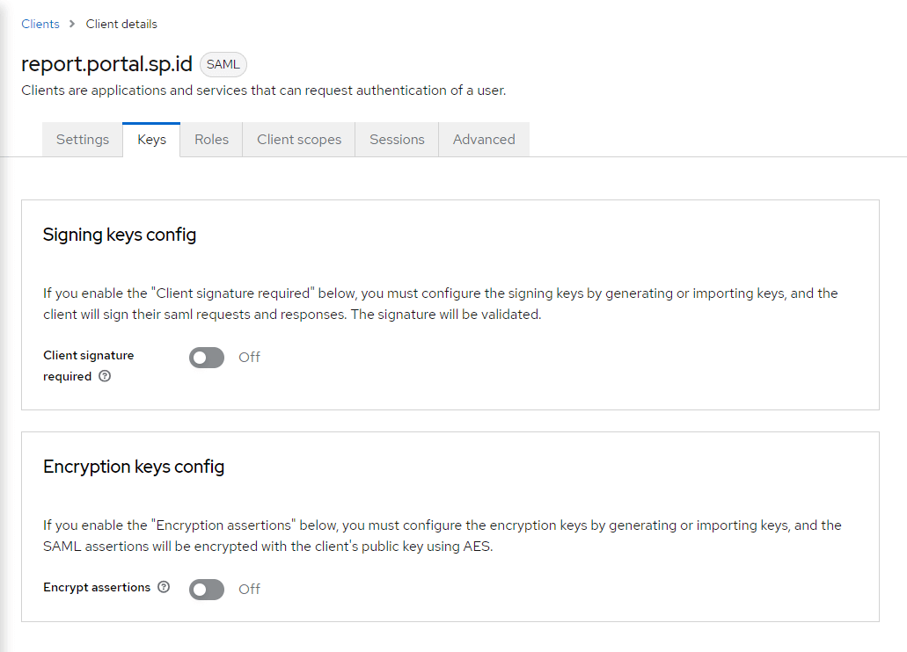
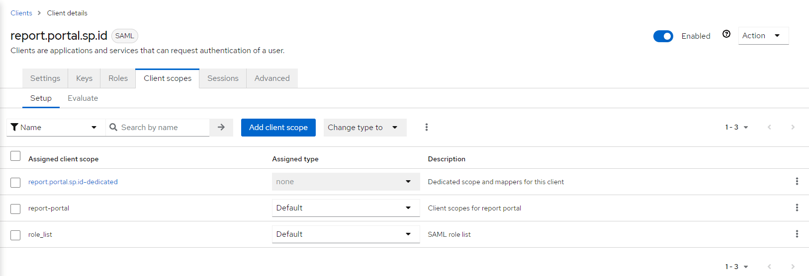
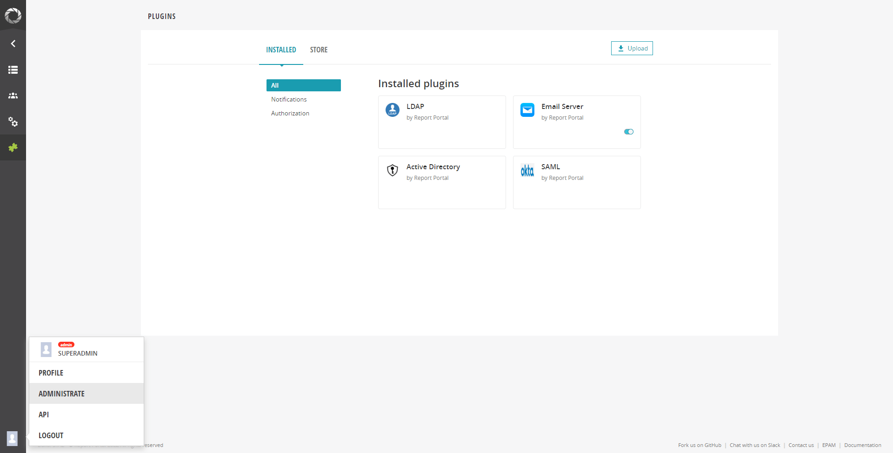
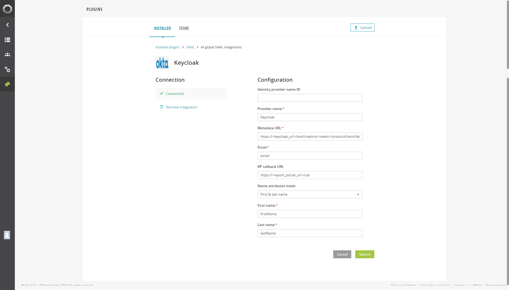
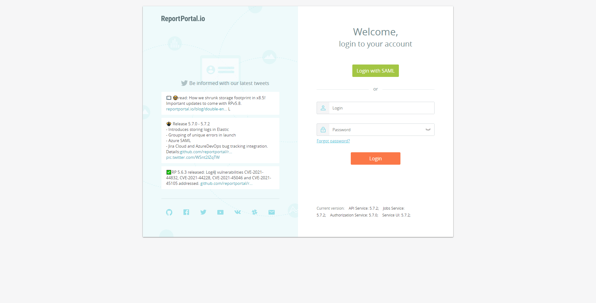

# Integrating ReportPortal with Keycloak: A Step-by-Step Guide

<head>
  <link rel="canonical" href="https://docs.kuberocketci.io/docs/operator-guide/project-management-and-reporting/reportportal-keycloak/" />
</head>

Follow the steps below to integrate the ReportPortal with Keycloak.

:::info
  It is also possible to install ReportPortal using the cluster add-ons. For details, please refer to the [Install via Add-Ons](../add-ons-overview.md) page.
:::

## Prerequisites

* Keycloak is installed. For detailed instructions, please refer to the provided [documentation](../auth/keycloak.md).
* ReportPortal is installed. To install it using the Helm Chart, please follow the instructions outlined in the corresponding [documentation](../project-management-and-reporting/install-reportportal.md).

## Keycloak Configuration

:::info
The Keycloak configuration can also be applied using Keycloak resources from the [Cluster Add-Ons](https://github.com/epam/edp-cluster-add-ons/tree/main/clusters/core/addons/report-portal/templates/saml) repository.
To apply the Keycloak configuration, the Keycloak Operator is required. For installation details, refer to the [Install Keycloak Operator](https://docs.kuberocketci.io/docs/next/operator-guide/auth/eks-oidc-integration#install-keycloak-operator) page.
:::

1. Navigate to **Client Scopes** > **Create client scope** and create a new scope with the _SAML_ protocol type.

2. Navigate to **Client Scopes** > **your_scope_name** > **Mappers** > **Configure a new mapper** > select the _User Attribute_ mapper type. Add three mappers for the email, first name, and last name by typing `lastName`, `firstName`, and `email` in the _User Attribute_ field:

    * _Name_ is a display name in Keycloak.
    * _User Attribute_ is a user property for mapping.
    * _SAML Attribute Name_ is an attribute used for requesting information in the ReportPortal configuration.
    * _SAML Attribute NameFormat_: `Basic`.
    * _Aggregate attribute values_: `Off`.

    
    

3. Navigate to **Clients** > **Create client** and fill in the following fields:

    * _Client type_: `SAML`.
    * _Client ID_: `report.portal.sp.id`.

    :::warning
      The `report.portal.sp.id` Client ID is a constant value.
    :::

4. Navigate to **Client** > **your_client** > **Settings** and add `https://<report-portal-url>/*` to the _Valid redirect URIs_.

5. Navigate to **Client** > **your_client** > **Keys** and disable _Client signature required_.

    

6. Navigate to **Client** > **your_client** > **Client scopes** and add the scope created on step 3 with the default _Assigned type_.

    

## ReportPortal Configuration

1. Log in to the ReportPortal with the admin permissions.

2. Navigate to **Client** > **Administrate** > **Plugins** and select the SAML plugin.

    

3. To add a new integration, fill in the following fields:

    

    * _Provider name_ is the display name in the ReportPortal login page.
    * _Metadata URL_ `https://<keycloak_url>/auth/realms/<realm>/protocol/saml/descriptor`.
    * _Email_ is the value from the _SAML Attribute Name_ field in the Keycloak mapper.
    * _RP callback URL_ `https://<report_portal_url>/uat`.
    * _Name attributes mode_ is the first & last name (type based on your mapper).
    * _First name_ is the value from the _SAML Attribute Name_ field in the Keycloak mapper.
    * _Last name_ is the value from the _SAML Attribute Name_ field in the Keycloak mapper.

4. Log in to the ReportPortal.

    :::note
      By default, after the first login, ReportPortal creates the `<your_email>_personal` project and adds an account with the `Project manager` role.
    :::

    

## Related Articles

* [Install ReportPortal](../project-management-and-reporting/install-reportportal.md)
* [Integration With Tekton](reportportal-tekton.md)
