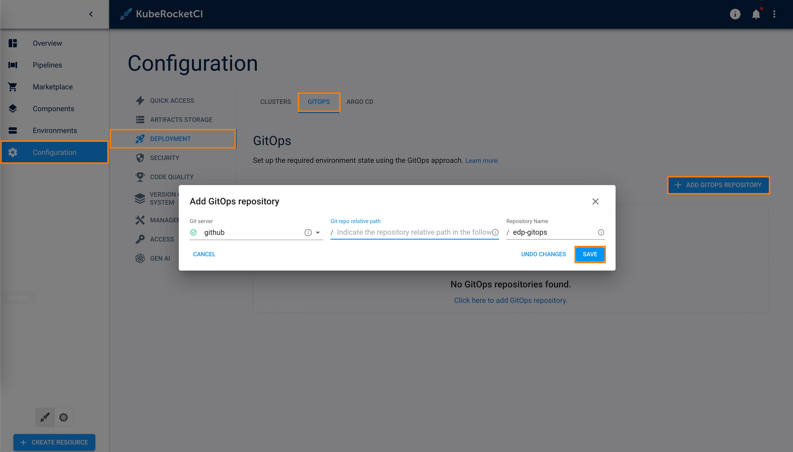
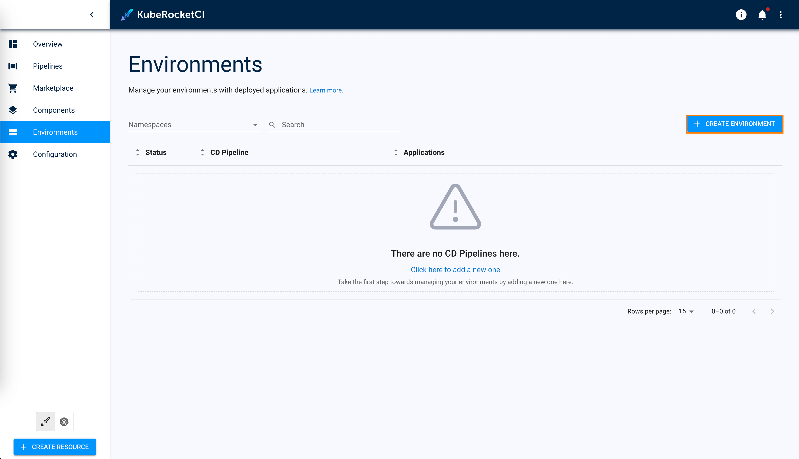
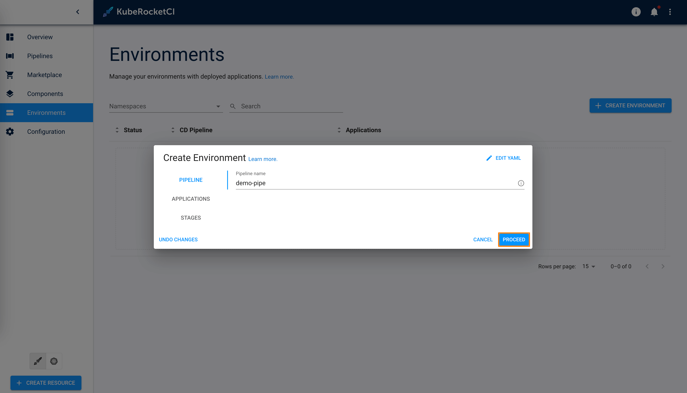
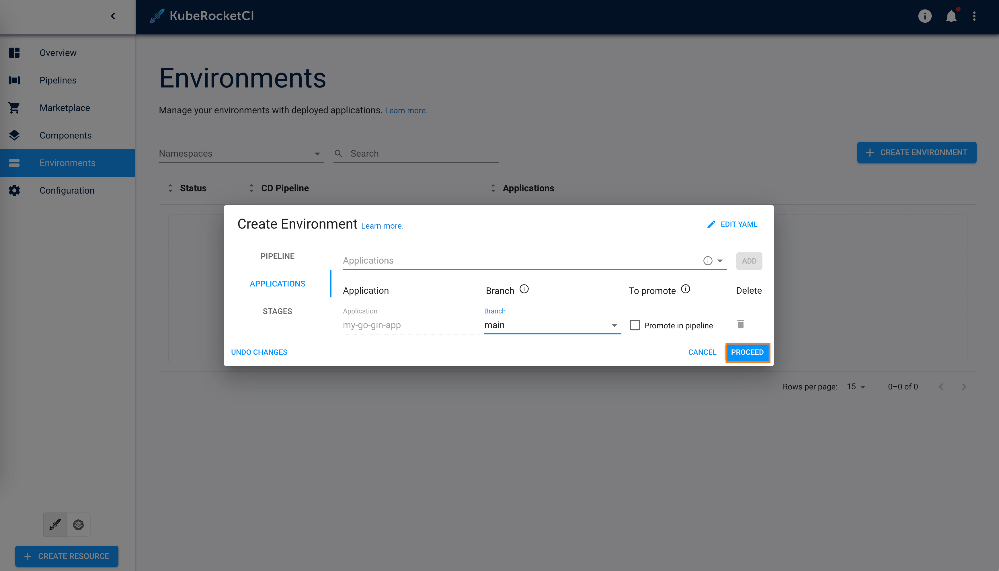
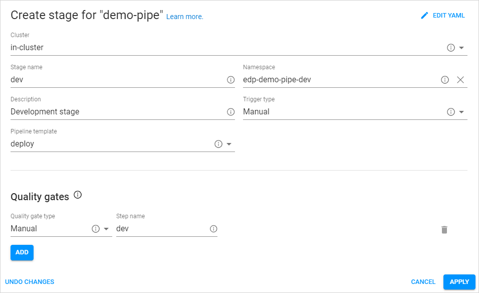
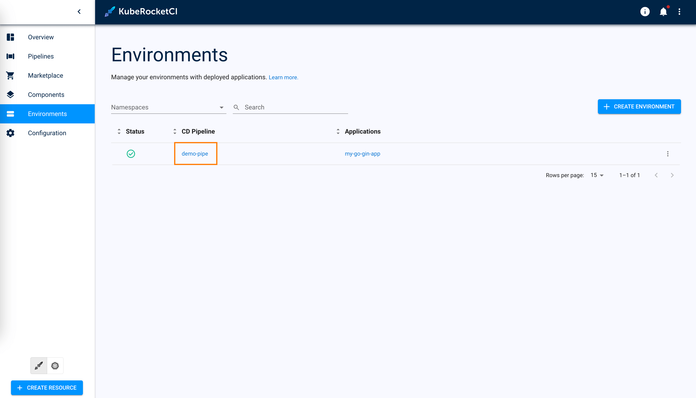
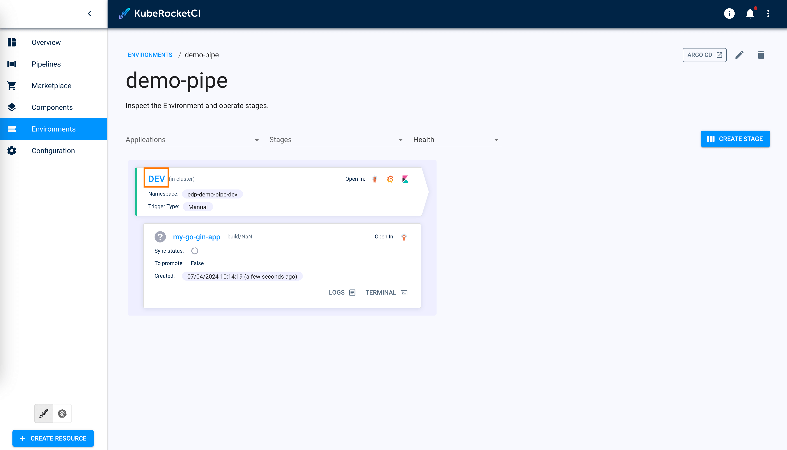
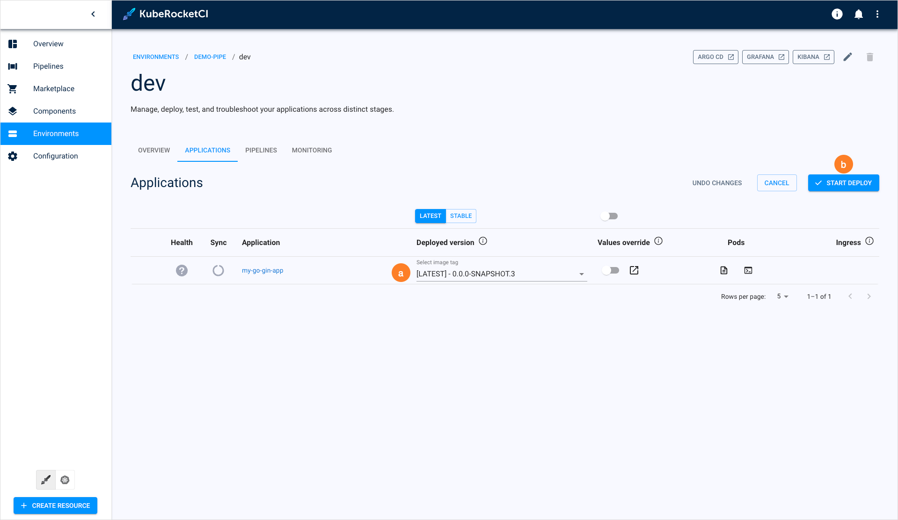

# Deploy Application

<head>
  <link rel="canonical" href="https://docs.kuberocketci.io/docs/quick-start/deploy-application/" />
</head>

Now, let's proceed to deploy our first application. This page offers detailed instructions on how to create an environment and deploy the application within it.

## Create GitOps Repository

As a prerequisite, create a GitOps repository in your GitHub account. KubeRocketCI Portal adheres to the GitOps approach when working with environments. In a GitOps repository, values are saved to redefine the default behavior (parameters) of deployment for each environment. The creation of a GitOps repository involves the following two steps:

1. In the UI Portal, navigate to **Configuration** -> **Deployment** -> **GitOps** -> **ADD GITOPS REPOSITORY**, define the following values and click **Save**:

    - Git server: `github`
    - Git repo relative path: `github_account_name`
    - Repository Name: `edp-gitops`

    

## Create Environment

To create an environment, follow the steps below:

1. In the UI Portal, navigate to **Environments** and click the **+ CREATE ENVIRONMENT** button:

    

2. In the **Create CD Pipeline** window, enter the pipeline name and click the **Proceed** button:

    

3. In the **Applications** tab, select the go-application and main branch:

    

4. In the **Stages** tab, click the **Add Stage** button.

5. Define the following values and click **Apply**:

    - Cluster: `in-cluster`
    - Stage name: `dev`
    - Namespace: `edp-my-go-gin-app-dev`
    - Description: `Development stage`
    - Trigger type: `Manual`
    - Pipeline template: `deploy`
    - Quality gate type: `Manual`
    - Step name: `dev`

    

6. In the **Stages** tab, click the **Apply** button.

## Application Deployment

To Deploy application, follow the steps below:

1. In the Environments list, click the Environment name:

    

2. In the Environment details page, click the stage name to enter the stage details:

    

3. Once you enter the stage details, proceed to deploy the application:

    1. Click the **CONFIGURE DEPLOY** button;
    2. Select the Image stream version;
    3. Click the **START DEPLOY** button.

    

Congratulations on completing the Quick Start guide! We hope you found this journey enjoyable.

Now that you have a good understanding of how KubeRocketCI works, you can further enhance its capabilities by integrating it with [Nexus](../operator-guide/artifacts-management/nexus-sonatype.md). Additionally, explore other functionalities detailed in our [Use Cases](../use-cases/index.md) section. If you're eager to unlock the full potential of KubeRocketCI, navigate to the [Operator Guide](../operator-guide/index.md) to fine-tune your KubeRocketCI for your specific requirements!
