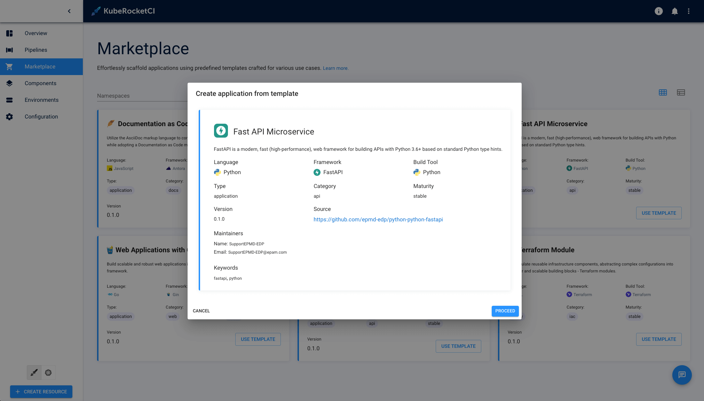
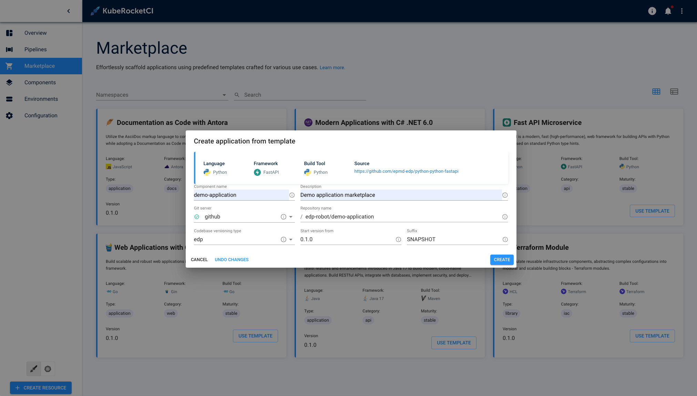
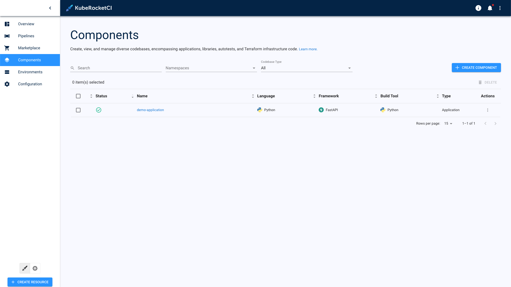

---

title: "Create Component via Marketplace"
sidebar_label: Create Component via Marketplace
description: "This page contains detailed guidelines on how to easily create a new application by clicking several buttons with the help of the Marketplace feature."

---
<!-- markdownlint-disable MD025 -->

# Create Component via Marketplace

<head>
  <link rel="canonical" href="https://docs.kuberocketci.io/docs/user-guide/add-marketplace" />
</head>

With the built-in Marketplace, users can easily create a new application by clicking several buttons. This page contains detailed guidelines on how to create a new component with the help of the Marketplace feature.

## Marketplace Benefits

The KubeRocketCI Marketplace streamlines component creation by providing predefined templates with built-in best practices. These templates offer several key advantages:

- **Accelerated Development**: Pre-configured templates eliminate the need to set up projects from scratch, significantly reducing initial development time
- **Standardization**: Ensures consistency across projects by providing standardized project structures, naming conventions, and configuration patterns
- **Built-in CI/CD**: Templates come with preconfigured Tekton pipelines for automated building, testing, and deployment workflows
- **Quality Assurance**: Integration with SonarQube for code quality analysis and SAST tools for security scanning
- **Framework Diversity**: Support for multiple programming languages and frameworks including Java, Node.js, .NET, Python, Go, and more
- **Custom Templates**: Organizations can create and share custom templates tailored to their specific requirements

## Prerequisites

Before creating a component via Marketplace, ensure you have:

- Access to the KubeRocketCI portal with appropriate permissions
- A configured Git server integration (GitHub, GitLab, Bitbucket, or Gerrit)
- Basic understanding of your target application requirements and technology stack
- Repository naming conventions and versioning strategy defined for your organization

## Template Categories

The Marketplace offers various template categories to support different development needs:

- **Applications**: Full-stack web applications, microservices, and API services
- **Libraries**: Reusable code libraries and shared components
- **Infrastructure**: Terraform modules and infrastructure-as-code templates
- **Automated Tests**: Testing frameworks and test suites for quality assurance

Each template includes comprehensive documentation, dependency management, and deployment configurations specific to its category.

## Add Component

To create a component from template, follow the instructions below:

1. Navigate to the **Marketplace** section on the navigation bar to see the Marketplace overview page.

2. Select the component, open its details window and click **Create from template**:

    

3. Fill in the required fields and click **Apply**:

    

4. As a result, new component will appear in the **Components** section:

    

## Post-Creation Steps

After successfully creating a component from a marketplace template, several automated processes begin:

### Automated Setup

- **Repository Creation**: A new Git repository is automatically created in your configured Git server with the template's initial codebase
- **CI/CD Pipeline Configuration**: Tekton pipelines are automatically set up for building, testing, and deploying your component
- **Integration Setup**: Webhooks and integrations with quality gates (SonarQube, security scanning) are automatically configured

### Next Steps

1. **Code Customization**: Clone the repository and begin customizing the template code to meet your specific requirements
2. **Environment Configuration**: Configure environment-specific settings and secrets through the KubeRocketCI portal
3. **CI/CD Validation**: Trigger the first build to validate that all pipelines are working correctly
4. **Quality Gates Setup**: Review and adjust code quality thresholds and security scanning rules as needed
5. **Deployment Strategy**: Configure your deployment strategy and target environments

## Troubleshooting Common Issues

### Template Creation Failures

If component creation fails, check the following:

- **Repository Permissions**: Ensure your Git server integration has sufficient permissions to create repositories
- **Naming Conflicts**: Verify that the repository name doesn't already exist in your Git server
- **Network Connectivity**: Confirm that KubeRocketCI can reach your Git server and external dependencies
- **Resource Quotas**: Check if there are any resource limitations in your Kubernetes cluster

### Missing Templates

If expected templates don't appear in the Marketplace:

- **Template Availability**: Verify that templates are properly registered in your KubeRocketCI instance
- **Permissions**: Ensure your user account has access to the required template categories
- **Template Repository**: Check if custom template repositories are correctly configured

For additional support, consult the KubeRocketCI logs or contact your platform administrator.

## Related Articles

- [Marketplace Overview](marketplace.md)
- [Add Application](add-application.md)
- [Add Library](add-library.md)
- [Add Infrastructure](add-infrastructure.md)
